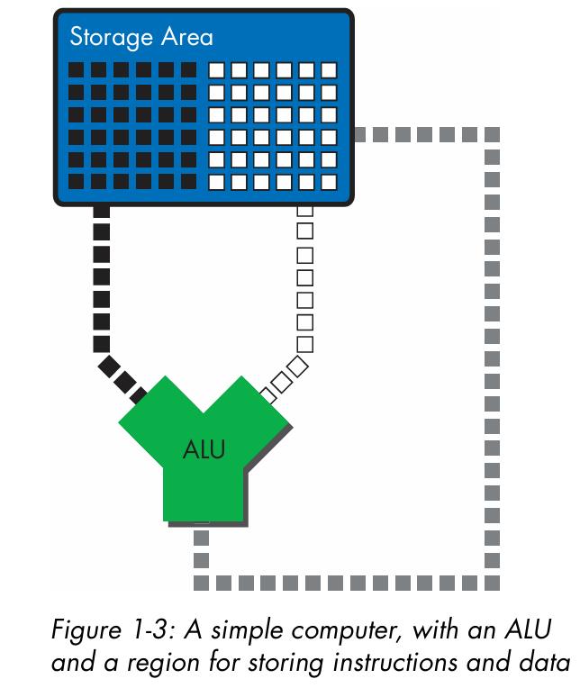
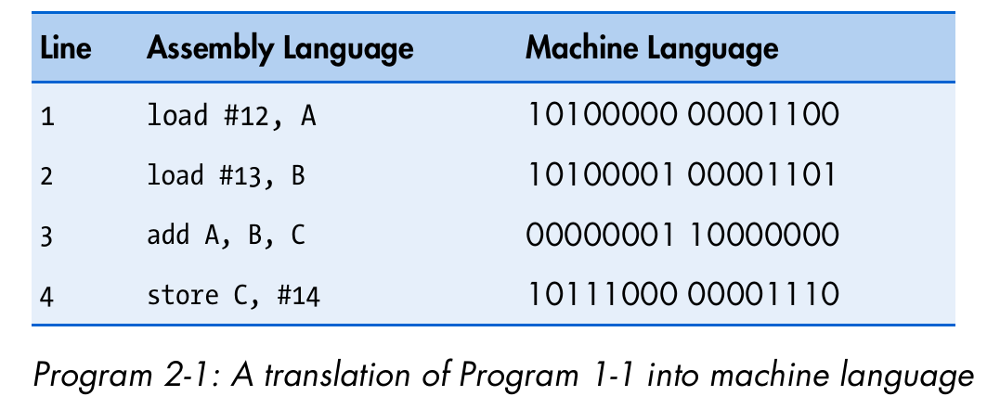

## Basics and mechanisms of computing

### Models of computing

- **Calculator Model** has a "code stream" and a "data stream" as an input and a "results stream" as an output. The data stream supplies the operands and the code stream supplies the instructions/operation.
- **File/Clerk Model** is just reading/writing/modifying different numbers in different locations over and over again until it decides to halt.

> There is strong focus on the book driving home the fact that the read/modify/write functionality is a repeating design decision at different computing complexity.

A direct consequence of combining both of these models is that we can identify the basic components needed for a simple micro processor:

- To "read" or "write" from we need a *storage*
- To "modify" we need an "ALU"
- Finally, to transfer data or code between storage and ALU we need a *bus*

Putting all of it together we get a super simple microprocessor/CPU with the capacity to access our storage for both - the code and the data. AND to execute and write things back to our storage

### Increasing the scope of the file-clerk model

With the current abstraction of our data storage being physically separated from the ALU, we will need a way to keep data close to (read: on) the ALU. To do this we have an ordered list of registers on our ALU. **This is called the register file**

This increases the scope of our interactions with the system. The code stream must also support *loading* data from the memory cells of our data storage to a register and *storing* data from a register to overwrite a memory cell. Meaning we need the following **instructions**:

- Memory access instructions
- Arithmetic/logical instructions

### Memory addresses being simple numbers is super helpful

Because the programmer can store the address in a register and treat the contents of that register as memory address to load/store on the said memory location. *Allows us to move past using immediate values as addresses + allows us to use multiple indirections dynamically*

> These registers are thus named *general purpose*, since they contain values AND addresses.
> IMP: Since we need to perform additions of the form (base + offset), super fast integer addition hardware is put on the load/store units.

Most importantly, it allows you to store the base address of a continuous data segment and add an offset to access any member of that segment! -> aka Register relative addressing. Pros?

> Programmers don't need to know the exact address, just the base and then use a relative offset.

### Machine code

Since we cant really have english mnemonics like `add`/`load` on a processor that only understands high or low voltages, The ISA typically designs how each x-byte (for a 32-bit ISA, this is 4-byte) instruction packs an `opcode`, and all the information needed by the operands (binary code of the source/destination registers, immediate values).

### Some more embellishments to our file-clerk model

Since the machine code lives in memory, we need a way to step-through the contents of the code while executing it. Thus, we add another layer of indirection here using two special registers:

- `program counter` stores the memory address of the next instruction to be looked at. In the image below, the `pc` stores `#500`.
- `instruction register` is where the contents of the memory cell written in the program counter is loaded. In the image below, we will load the instruction on the memory cell `#500`.

> I am not sure if each instruction is 2-bytes long, then how do we fit it in one instruction register to further decode it. One thing that I can think of is that the opcode is the only thing needed to set all flags of various components of our pipeline. Since the opcode fits in the first.

The program counter *by default* will be incremented to the starting point of the next immediate instruction i.e., 2-bytes in this example. This default behaviour is overidden to support branching, and that is where having a separate register for the program counter is super-useful. Still, for conditional branching, we will need to somehow store the result of the evaluation of the condition. In fact, it might be helpful to imagine that the branch instruction is a special load that the programmer can write, while the default instruction fetch is something that the CPU controls automatically (oh, and that this load isn't going to our good old general purpose registers but to the special program counter register).

One way would be to store result into a register and then store it onto the data storage. But, this would make each branch a multi-cycle process. Instead, the solution that we use is to add yet another register. The `Proc. State Word` register updates a bunch of flags that as a side-effect to each operation done on the ALU. Now, the condition can be evaluated by the ALU, and the result is still stored on the compute unit without having to manually store it elsewhere. Clean!

> The flags in question are the familiar overflow, carry, negative, zero etc flags. Note that this also lets us pack many flags that are only a single bit onto a full memory cell/word. Clean x2!!

### Rabbit hole: The very first jump instruction

When the device boots up, the logic to start working is usually also on the memory. How can we access the instructions in memory when there is nothing loaded onto the memory yet. We add a small, ROM which at bootstrap runs a predetermined first instruction to jump to the entry point of the BIOS program. This conducts some sanity checks and further jumps to the entry point of the bootloader program which loads the OS from the hard disk.

Funny enough, to allow programmers to be able to write and tweak BIOS settings like overclocking. This memory needs to be able to handle multiple write cycles. Thus, we store it on volatile memory, but to keep the settings, alive the volatile memory would need power. And so a tiny CMOS battery is often put on the motherboard to keep it active.

> ASIDE 1: Remember that the settings are what are stored on this small volatile memory, the actual BIOS firmware code lives on a non-volatile flash memory. This also helps restore factory settings for the firmware. If you brick your motherboard, then all you need is to pull the CMOS battery to come back to the default for the firmware.
> ASIDE 2: The CMOS cell does a little more, it also keeps the real-time clock running forever so your computer boots with the correct local time.

## Pipelined execution
TBD