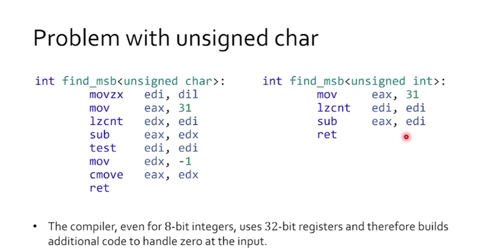
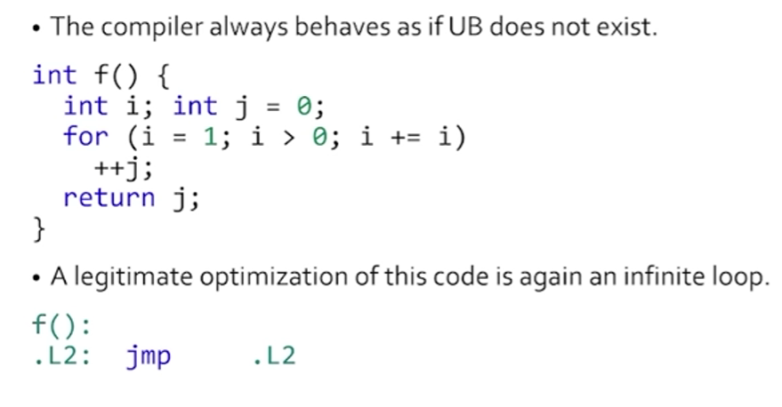
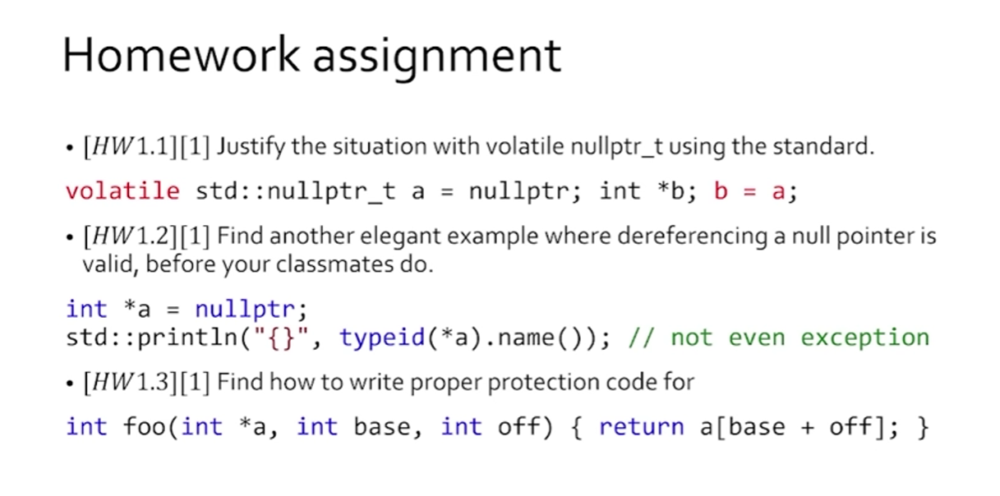

In this course, we will assume that we are enabling a good level of compiler optimizations. We will also work mainly with C++23 and sometimes C++26.

## Lecture 1 : The Very Soul of C++

> Watch the lecture on YouTube [here](https://www.youtube.com/watch?v=X6GVR_3FCHU)

Some jargon that is always thrown around with cpp:

- General purpose a.k.a. the second best language for everything ;)
- Statically typed (tbd) 
- Statically compiled; the compiled to machine code file is end all be all

The language standard is NOT the final approach to implementation, it ONLY guarantees the translation. It is an agreement between the compiler devs (producers of the language translation implmentation: gcc, clang, msvc..) and the programmers (consumers of the compiler!). Thus, the language standard either translates the program or issues a diagnostic, it should not act like a static analyzer and freely issue false positives.

:::caution
There are caveats, like linker diagnostics being used for missing forward declarations. More on that later. The primary idea is to clarify what the language standard aims to and does NOT aim to do.
:::

### Vectors of development

Consider an implementation of something like a `find_msb`. The most C-like way of doing this is to have a for loop. Since we don't have templates/generics in C, we use a macro on the parameter type:

```cpp
int find_msb(MSB_TYPE msb) {
    int MAX_BIT = sizeof(MSB_TYPE) * CHAR_BIT;
    for (int i = 0; i < MAX_BIT; i++) {
        if (msb & (1 << i)) {
            return i;
        }
    }
    return -1;
}
```

This is okay, but we wish to avoid the loop and here we see the vector of development from **common idiom to machine instructions**. The value of `i` above can be determined using a single `__builtin_clz()` call which is implemented on certain compilers and machines and translates to the equivalent of a `clzw` **single machine instruction**. This is much faster (no branch prediction needed, less memory overhead of loop variable, fewer clock cycles, cleaner code... need I say more:p).

```cpp
int find_msb(MSB_TYPE msb) {
    int total_bits = sizeof(MSB_TYPE) * CHAR_BIT;
    int leading_zeros = __builtin_clz(msb);
    return total_bits - leading_zeros - 1;
}
```

Besides, a use of macro here implies that the either us (the programmers) or the language standards (the compiler devs) have missed something... which takes us to the next vector of development **compiler instrinsics to standard implementation**.

Subtle, but the entire reason why something like `__builtin_clz` exists as a compiler/machine dependent behaviour is that it is useful. It is a natural for the programmer to expect from the compiler dev that this feature become a standard language feature instead i.e., from `__builtin_clz` to `template<class T> countl_zero`. Note that the `countl_zero` function can only accept unsigned types. We get:

```cpp
template<typename T>
int find_msb(T value) {
    using U = std::make_unsigned_t<T>;
    const auto digits = std::numeric_limits<U>::digits;
    const auto leading_zeros = std::countl_zero(static_cast<U>(digits));
    return digits - leading_zeros - 1;
}
```

This is okay, but but but, we can always generalize this further. The version below accepts anything that can only take in integral types. We would like to make our function accept ANY non-integral type so long as it can logically find an MSB (*think, atcoder's ModInt*). Concepts to the rescue:

```cpp
int find_msb(std::integral auto value) {
    using U = std::make_unsigned_t<decltype(value)>;
    const auto digits = std::numeric_limits<U>::digits;
    const auto leading_zeros = std::countl_zero(static_cast<U>(digits));
    return digits - leading_zeros - 1;
}
```

:::note
Notice that this version still has some type deduction machinery (`auto` uses the template type deduction machinery inside the compiler anyways!), just that we increase and restrict the domain of the incoming input types. Cleanly imposes requirements on by adding a layer of indirection.
:::

### Users can insert UB for compiler opts as well (+contracts FTW)



To help us remove the extra LOC, avoid the `int`-promotion and avoid the slightly expensive `cmov`. ~~The grandmaster will sacrifice the exchange:P~~ We will manually insert UB to eradicate the leading path to that point and optimize awat with it any extra case handling.

:::caution
To avoid unleashing cthulhu we add a pre-condition contract to the function
:::

```cpp
int find_msb(std::integral auto value) 
pre(value != 0)
{
    if (value == 0) std::unreachable(); // -> UB, but improves generated asm
    using U = std::make_unsigned_t<decltype(value)>;
    const auto digits = std::numeric_limits<U>::digits;
    const auto leading_zeros = std::countl_zero(static_cast<U>(digits));
    return digits - leading_zeros - 1;
}
```

### Abstract Machine of cpp

- Non-deterministic (different runs may give different answers, both are correct)
- Language standard defines it
- Is not defined everywhere (yay, UB)
- Parameterized. That is, compiler/machine specific behavior of some functionality of the abstract machine must be defined by the compiler devs.

Compiler uses them for optimizations mostly on the basis of there being no side-effects

:::important[The so called "as-if" rule]
More formally, the compiler can do anything as long as the observable behavior of the abstract machine (program) does not change. This is a necessary condition but not sufficient.
:::

Observable behavior consists of:

- Order of data written to file.
- Accessing volatile glvalues.
- I/O device interactions.

A lack of side-effects does not necessitate the compiler to start optimizing things away. In the example below, the return value cannot be optimized away since there is an external linkage of the `i` variable and the integer being returned via the return slot might be getting assigned to a volatile glvalue.

:::note[Fun fact]
In C++ we consider the scope of connections that the compiler can see as a *translation unit*, unlike C where the file is considered a translation unit.
:::

```cpp
int check(int i) { /*External linkage*/
    return i * i + i * 8 + 42; // Cant just optimize this away
}
```

:::tip
You can usually think about this by ascertaining if something *could be* assigned to a volatile glvalue.
:::

### UB is a guarantee we give to the compiler, to do absolutely anything

If UB exists in code, not only does the compiler turn blind to that specific LOC, it is free to do anything in the code preceding the location of UB. It can remove everything and consequently lead to an infinite loop as shown below.

This responsibility is on the programmer ONLY, since they have assured the programmer that this is UB and that they guarantee that this UB will never be triggered. Thus an *as-if* behavior is triggered that makes the compiler act as if the UB is never reached. Also, [fun stuff linked here](https://lore.kernel.org/llvm/20250426200513.GA427956@ax162/).

:::important
For the compiler, UB doesn't exist. So if something goes wrong, then the responsibily is on the programmer. The compiler will usually follow a simple mechanism and remove the entire path leading upto UB by assuming that it is unreachable. This will either happen due to the as-if rule seeing no side-effects or because it is on the path to UB.
:::



Another example of the compiler assuming that UB cannot be reached at all.

```cpp
int foo(bool c) {
    int x, y; // x is uninitialized, UB!
    y = c ? x : 42; // The compiler removes the case where we use x at all

    // The above line becomes y = 42, and finally, constant folded to ignore
    // c all the time and just return 42. Thus, foo(true) == 42
    return y;
}
```

### Erroneous behaviour and erroneous values (C++ 26)

```cpp
char a;
char b [[indeterminate]];

char c = a + 1; // c contains an erroneous value, since uninitialized vars are EB not UB
char d = b + 1; // This is UB, since we mark b's uninitialization with the UB attribute "indeterminate"

unsigned char e; // EB
unsigned char f = e; // EB, but now f gets "erroneous value"
assert(e == f); // This evaluates to true since both are erroneous
```

Note that in the above example, `c` still gets optimized due to the UBness of `b` in the next line `char d = b + 1`; NOT by any fault of `a` or `c` being undefined/assigned to undefined. EB is allowed to be done, AND recommended by the compiler to diagnose, garbage in garbage out.

### Homework


:::note
Submitting a patch for 1.1 will earn more points
:::

#### Solution for H.W[1.1]

TBD

#### Solution for H.W[1.2]

:::warning
I am not entirely sure if this answer suffices all expectations.
:::

```cpp
#include <iostream>
#include <limits>

template<typename T>
int what(T a) {
    return std::numeric_limits<T>::max();
}

void ujjwal() {
    int *a = nullptr;
    std::cout << what(*a);
}

void lecture() {
    int *a = nullptr;
    std::cout << typeid(*a).name();
}

int main() {
    ujjwal();
    lecture();  

    /* Output seen for Clang and GCC both
    2147483647i
    */  
}
```

[You may check the code generated for this here](https://godbolt.org/z/Ec4cPzqnq)

#### Solution for H.W[1.3]

```cpp
#include <limits>

constexpr int BAD_VAL = -1;

int foo_wrong(int *a, int base, int off) {
    if (off > 0 and base > base + off) {
        return BAD_VAL;
    }
    // Above got removed because overflow can never
    // happen and the condition is treated as false
    // and removed by UB blindness

    return a[base + off];
}

int foo_ok(int *a, int base, int off) {
    if (off > 0 and base > std::numeric_limits<int>::max() - off) {
        return BAD_VAL;
    }
    // Does not depend on the overflow to act, instead
    // the equation base + off > MAX is rearranged!

    return a[base + off];
}
```

[You may check the code generated for this here](https://godbolt.org/z/1Waf8eqc7)

### Extra essential viewing

:::note
At some point I realized that I wasn't very clear on the specific behavior of signed and unsigned overflows while watching Chandler's talk, I took a detour with the [blog on overflow by Ian](https://www.airs.com/blog/archives/120)
:::

#### Rabbit hole: Ian's blog on overflow and some more digging

> [Read it here](https://www.airs.com/blog/archives/120)

Signed integer overflow is considered UB by the standard. So, a C/C++ program that contains signed overflow is considered wrong. Thus, the compiler is free to assume that a given program will not contain signed integer overflow, and if it does anything can be done to it. OTOH, unsigned integer overflow is indeed defined behavior.

*But... why? they are either BOTH UB or BOTH IB/DB right?* No, there are a few caveats with the treatment of a signed integer. Different processors treat signed integer representation of a binary differently. Some use the 2's complement method, while some use 1's complement. Thus, the language standard cannot define a set behavior on signed overflow if the underlying hardware changes. With the unsigned integer, it is obvious that the same bit representation will be treated exactly the same across machines. Thus, overflow can be treated as a "wrap around" (modulo MAX + 1).

*No chance that we can define the signed integer overflow behavior?* Nope, the hardware differences are too wide. By fixing the behavior to one style, we would be antagonizing the users of hardware that is non-conformant to the standard. Plus, far too many optimizations exist due to UB which would otherwise be completely lost. For example here, `if (i + 1 < i) { ... }  // always false if overflow can't happen` can be replaced by the compiler to be `false` directly. If you use flags like `-fwrapv` or `-fno-strict-overflow` then indeed the behavior is fixed at a performance cost. Use builtins like `__builtin_add_overflow(a, b, &result)` (detect overflow safely).

#### CppCon 2016: Chandler Carruth “Garbage In, Garbage Out: Arguing about Undefined Behavior..."

> [Watch it on YouTube here](https://www.youtube.com/watch?v=yG1OZ69H_-o)

:::tip
The summary of the first half of the talk is essentially that *UB is NOT a compiler bug, it is a human violation of the contracts provided by the standard.
:::

That's it, we must start treating UB as a lack of the user's (programmer's) lack of knowledge about the working of the language. When they break the contract that the language provides (e.g: dereference a null pointer), they made that error, and as specified by the standard, all bets are off. Sure, UB *could* allow the compiler to optimize the generated asm, but it is still a valid behaviour even if the final behaviour of the code is not what the user wanted.

### Okay then, lets widen all of our contracts and define all behavior

#### Define all behavior

This problem is simply intractable. consider a function `Node findSink( const vector<Node*>& graph )`. If this is defined in a way that recurses to find a node that is a sink, then upon being given a graph which is cyclic any of the following could happen:

- The recursion forces the stack to grow to an overflow, and it gets killed by the OS
- The implementation is optimizable to a tail recursion, which causes there to be an infinite loop.
- Some node pointer corrupts due to the growing stack and a dereference goes on to hit a guarded page, leading to a segfault.

Can you define this behaviour? No you cannot, it has to be platform/hardware/compiler defined. Matter of fact, all three cases are (usually) possible to hit in most cases so the result is non-deterministic across different runs of the binary. Remember, UB does not guarantee consistent behaviour across runs -- all bets are off.

#### Widen all contracts

In the previous example, the only way to do that would be to add a runtime pre-condition contract that first processes the graph to find a cycle. This needs extra memory, this needs extra runtime performance cost. Not all users are going to be happy with that. In fact, such a pre-condition might be essentially impossible to write. To add a pre-condition that disallows inputs going into an infinite loop is reducible to solving the halting problem. So, we are stuck with a logical bottleneck to eliminating UB.

### Pay for what you use: Narrow contracts when we need them, are okay

Principles for narrow contracts:

- Checkable (probabilistically) at runtime
- Provides immense value as a trade-off
- Should not break existing code (or coding practices that are widely accepted)

TBD

#### CppCon 2017: Piotr Padlewski “Undefined Behaviour is awesome!”

TBD