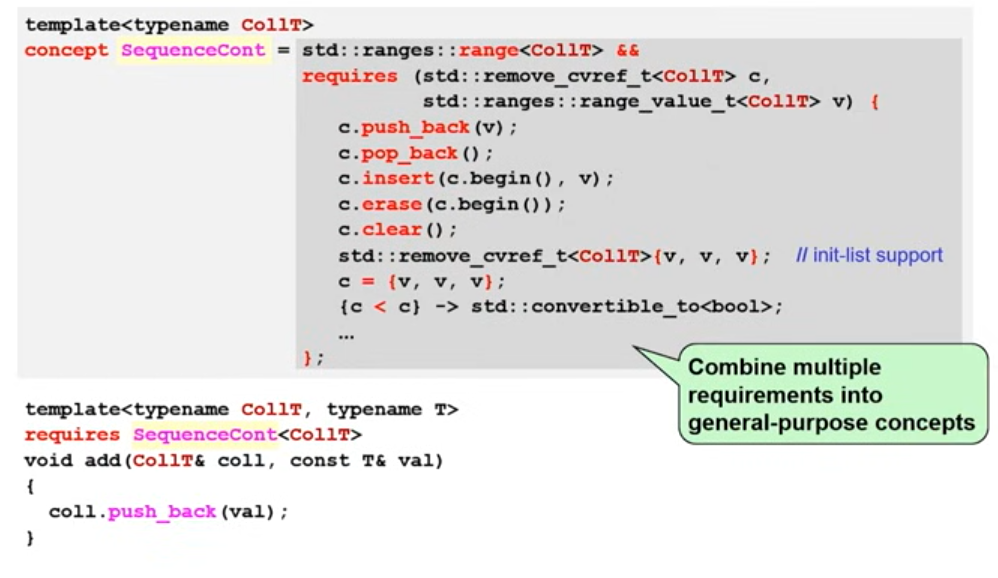
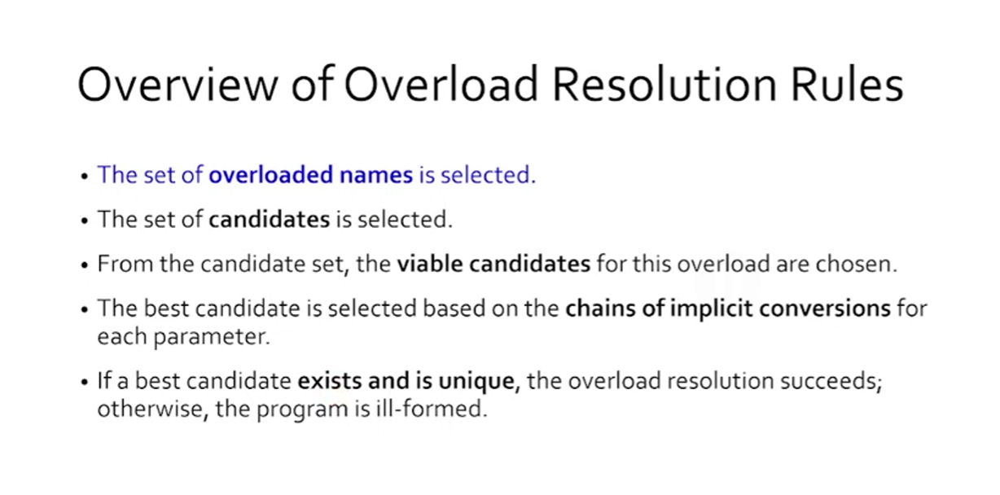
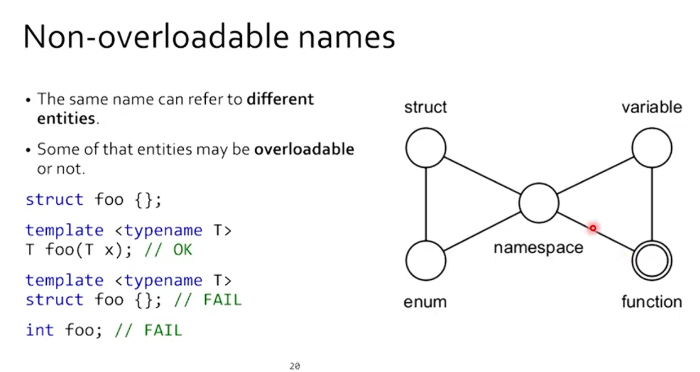
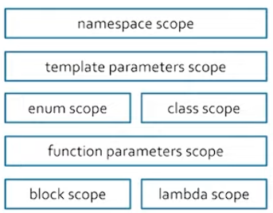

In this course, we will assume that we are enabling a good level of compiler optimizations. We will also work mainly with C++23 and sometimes C++26.

## Lecture 1 : The Very Soul of C++

> Watch the lecture on YouTube [here](https://www.youtube.com/watch?v=X6GVR_3FCHU)

Some jargon that is always thrown around with cpp:

- General purpose a.k.a. the second best language for everything ;)
- Statically typed (tbd) 
- Statically compiled: the compiled -> machine code file is end all be all

The language standard is NOT the final approach to implementation, it ONLY guarantees the translation. It is an agreement between the compiler devs (producers of the language translation implmentation: gcc, clang, msvc..) and the programmers (consumers of the compiler!). Thus, the language standard either translates the program or issues a diagnostic, it should not act like a static analyzer and freely issue false positives.

:::caution
There are caveats, like linker diagnostics being used for missing forward declarations. More on that later. The primary idea is to clarify what the language standard aims to and does NOT aim to do.
:::

### Vectors of development

Consider an implementation of something like a `find_msb`. The most C-like way of doing this is to have a for loop. Since we don't have templates/generics in C, we use a macro on the parameter type:

```cpp
int find_msb(MSB_TYPE msb) {
    int MAX_BIT = sizeof(MSB_TYPE) * CHAR_BIT;
    for (int i = 0; i < MAX_BIT; i++) {
        if (msb & (1 << i)) {
            return i;
        }
    }
    return -1;
}
```

This is okay, but we wish to avoid the loop and here we see the vector of development from **common idiom to machine instructions**. The value of `i` above can be determined using a single `__builtin_clz()` call which is implemented on certain compilers and machines and translates to the equivalent of a `clzw` **single machine instruction**. This is much faster (no branch prediction needed, less memory overhead of loop variable, fewer clock cycles, cleaner code... need I say more:p).

```cpp
int find_msb(MSB_TYPE msb) {
    int total_bits = sizeof(MSB_TYPE) * CHAR_BIT;
    int leading_zeros = __builtin_clz(msb);
    return total_bits - leading_zeros - 1;
}
```

Besides, a use of macro here implies that the either us (the programmers) or the language standards (the compiler devs) have missed something... which takes us to the next vector of development **compiler instrinsics to standard implementation**.

Subtle, but the entire reason why something like `__builtin_clz` exists as a compiler/machine dependent behaviour is that it is useful. It is a natural next step for the programmer to expect from the compiler dev that this feature become a standard language feature instead i.e., from `__builtin_clz` to `template<class T> countl_zero`. Note that the `countl_zero` function can only accept unsigned types. We get:

```cpp
template<typename T>
int find_msb(T value) {
    using U = std::make_unsigned_t<T>;
    const auto digits = std::numeric_limits<U>::digits;
    const auto leading_zeros = std::countl_zero(static_cast<U>(digits));
    return digits - leading_zeros - 1;
}
```

This is okay, but but but, we can always generalize this further. The version below accepts anything that can only take in integral types. We would like to make our function accept ANY non-integral type so long as it can logically find an MSB (*think, atcoder's ModInt*). Concepts to the rescue:

```cpp
int find_msb(std::integral auto value) {
    using U = std::make_unsigned_t<decltype(value)>;
    const auto digits = std::numeric_limits<U>::digits;
    const auto leading_zeros = std::countl_zero(static_cast<U>(digits));
    return digits - leading_zeros - 1;
}
```

:::note
Notice that this version still has some type deduction machinery (`auto` uses the template type deduction machinery inside the compiler anyways!), just that we increase (but continue to restrict) the domain of the incoming input types. Cleanly imposes requirements on the incoming type by adding a layer of indirection.
:::

### Users can insert UB for compiler opts as well (+contracts FTW)


To help us remove the extra LOC, avoid the `int`-promotion and avoid the slightly expensive `cmov`. ~~The grandmaster will sacrifice the exchange:P~~ We will manually insert UB to eradicate the leading path to that point and optimize awat with it any extra case handling.

:::caution
To avoid unleashing cthulhu we add a pre-condition contract to the function
:::

```cpp
int find_msb(std::integral auto value) 
pre(value != 0)
{
    if (value == 0) std::unreachable(); // -> UB, but improves generated asm
    using U = std::make_unsigned_t<decltype(value)>;
    const auto digits = std::numeric_limits<U>::digits;
    const auto leading_zeros = std::countl_zero(static_cast<U>(digits));
    return digits - leading_zeros - 1;
}
```

### Abstract Machine of cpp

- Non-deterministic (different runs may give different answers, both are correct)
- Language standard defines it
- Is not defined everywhere (yay, UB)
- Parameterized. That is, compiler/machine specific behavior of some functionality of the abstract machine must be defined by the compiler devs.

Compiler uses these properties for optimizations mostly on the basis of there being no side-effects

:::important[The so called "as-if" rule]
More formally, the compiler can do anything as long as the observable behavior of the abstract machine (program) does not change. This is a necessary condition but not sufficient.
:::

Observable behavior consists of:

- Order of data written to file.
- Accessing volatile glvalues.
- I/O device interactions.

A lack of side-effects does not necessitate the compiler to start optimizing things away. In the example below, the return value cannot be optimized away since there is an external linkage of the `i` variable and the integer being returned via the return slot might be getting assigned to a volatile glvalue.

:::note[Fun fact]
In C++ we consider the scope of connections that the compiler can see as a *translation unit*, unlike C where the file is considered a translation unit.
:::

```cpp
int check(int i) { /*External linkage*/
    return i * i + i * 8 + 42; // Cant just optimize this away
}
```

:::tip
You can usually think about this by ascertaining if something *could be* assigned to a volatile glvalue.
:::

### UB is a guarantee we give to the compiler, to do absolutely anything

If UB exists in code, not only does the compiler turn blind to that specific LOC, it is free to do anything in the code preceding the location of UB. It can remove everything and consequently lead to an infinite loop as shown below.

This responsibility is on the programmer ONLY, since they have assured the compiler that this is UB and that they guarantee that this UB will never be triggered. Thus an *as-if* behavior is triggered that makes the compiler act as if the UB is never reached. Also, [fun stuff linked here](https://lore.kernel.org/llvm/20250426200513.GA427956@ax162/).

:::important
For the compiler, UB doesn't exist. So if something goes wrong, then the responsibily is on the programmer. The compiler will usually follow a simple mechanism and remove the entire path leading upto UB by assuming that it is unreachable. This will either happen due to the as-if rule seeing no side-effects or because it is on the path to UB.
:::


Another example of the compiler assuming that UB cannot be reached at all.

```cpp
int foo(bool c) {
    int x, y; // x is uninitialized, UB!
    y = c ? x : 42; // The compiler removes the case where we use x at all

    // The above line becomes y = 42, and finally, constant folded to ignore
    // c all the time and just return 42. Thus, foo(true) == 42
    return y;
}
```

### Erroneous behaviour and erroneous values (C++ 26)

```cpp
char a;
char b [[indeterminate]];

char c = a + 1; // c contains an erroneous value, since uninitialized vars are EB not UB
char d = b + 1; // This is UB, since we mark b's uninitialization with the UB attribute "indeterminate"

unsigned char e; // EB
unsigned char f = e; // EB, but now f gets "erroneous value"
assert(e == f); // This evaluates to true since both are erroneous
```

Note that in the above example, `c` can still get optimized away due to the UBness of `b` in the next line `char d = b + 1`; NOT by any fault of `a` or `c` (being undefined/assigned to undefined). EB is allowed to be done, AND recommended by the compiler to diagnose, garbage in garbage out.

### Homework


:::note
Submitting a patch for 1.1 will earn more points
:::

#### Solution for H.W[1.1]

TBD

#### Solution for H.W[1.2]

:::warning
I am not entirely sure if this answer suffices all expectations.
:::

```cpp
#include <iostream>
#include <limits>

template<typename T>
int what(T a) {
    return std::numeric_limits<T>::max();
}

void ujjwal() {
    int *a = nullptr;
    std::cout << what(*a);
}

void lecture() {
    int *a = nullptr;
    std::cout << typeid(*a).name();
}

int main() {
    ujjwal();
    lecture();  

    /* Output seen for Clang and GCC both
    2147483647i
    */  
}
```

[You may check the code generated for this here](https://godbolt.org/z/Ec4cPzqnq)

#### Solution for H.W[1.3]

```cpp
#include <limits>

constexpr int BAD_VAL = -1;

int foo_wrong(int *a, int base, int off) {
    if (off > 0 and base > base + off) {
        return BAD_VAL;
    }
    // Above got removed because overflow can never
    // happen and the condition is treated as false
    // and removed by UB blindness

    return a[base + off];
}

int foo_ok(int *a, int base, int off) {
    if (off > 0 and base > std::numeric_limits<int>::max() - off) {
        return BAD_VAL;
    }
    // Does not depend on the overflow to act, instead
    // the equation base + off > MAX is rearranged!

    return a[base + off];
}
```

[You may check the code generated for this here](https://godbolt.org/z/1Waf8eqc7)

### Extra essential viewing

:::note
At some point I realized that I wasn't very clear on the specific behavior of signed and unsigned overflows while watching Chandler's talk, I took a detour with the [blog on overflow by Ian](https://www.airs.com/blog/archives/120)
:::

#### Rabbit hole: Ian's blog on overflow and some more digging

> [Read it here](https://www.airs.com/blog/archives/120)

Signed integer overflow is considered UB by the standard. So, a C/C++ program that contains signed overflow is considered wrong. Thus, the compiler is free to assume that a given program will not contain signed integer overflow, and if it does anything can be done to it. OTOH, unsigned integer overflow is indeed defined behavior.

*But... why? they are either BOTH UB or BOTH IB/DB right?* No, there are a few caveats with the treatment of a signed integer. Different processors treat signed integer representation of a binary differently. Some use the 2's complement method, while some use 1's complement. Thus, the language standard cannot define a set behavior on signed overflow if the underlying hardware changes. With the unsigned integer, it is obvious that the same bit representation will be treated exactly the same across machines. Thus, overflow can be treated as a "wrap around" (modulo MAX + 1).

*No chance that we can define the signed integer overflow behavior?* Nope, the hardware differences are too wide. By fixing the behavior to one style, we would be antagonizing the users of hardware that is non-conformant to the standard. Plus, far too many optimizations exist due to UB which would otherwise be completely lost. For example here, `if (i + 1 < i) { ... }  // always false if overflow can't happen` can be replaced by the compiler to be `false` directly. If you use flags like `-fwrapv` or `-fno-strict-overflow` then indeed the behavior is fixed at a performance cost. Use builtins like `__builtin_add_overflow(a, b, &result)` (detect overflow safely).

#### CppCon 2016: Chandler Carruth “Garbage In, Garbage Out: Arguing about Undefined Behavior..."

> [Watch it on YouTube here](https://www.youtube.com/watch?v=yG1OZ69H_-o)

:::tip
The summary of the first half of the talk is essentially that *UB is NOT a compiler bug, it is a human violation of the contracts provided by the standard.
:::

That's it, we must start treating UB as a lack of the user's (read: programmer's) knowledge about the working of the language. When they break the contract that the language provides (e.g: dereference a null pointer), they made that error, and as specified by the standard, all bets are off. Sure, UB *could* allow the compiler to optimize the generated asm. However, it is still a valid behaviour even if the final behaviour of the code is not what the user wanted.

### Okay then, lets widen all of our contracts and define all behavior

#### Define all behavior

This problem is simply intractable. consider a function `Node findSink( const vector<Node*>& graph )`. If this is defined in a way that recurses to find a node that is a sink, then upon being given a graph which is cyclic any of the following could happen:

- The recursion forces the stack to grow to an overflow, and it gets killed by the OS
- The implementation is optimizable to a tail recursion, which causes there to be an infinite loop.
- Some node pointer corrupts due to the growing stack and a dereference goes on to hit a guarded page, leading to a segfault.

Can you define this behaviour? No you cannot, it has to be platform/hardware/compiler defined. Matter of fact, all three cases are (usually) possible to hit in most cases so the result is non-deterministic across different runs of the binary. Remember, UB does not guarantee consistent behaviour across runs -- all bets are off.

#### Widen all contracts

In the previous example, the only way to do that would be to add a runtime pre-condition contract that first processes the graph to find a cycle. This needs extra memory, this needs extra runtime performance cost. Not all users are going to be happy with that. In fact, such a pre-condition might be essentially impossible to write. To add a pre-condition that disallows inputs going into an infinite loop is reducible to solving the halting problem. So, we are stuck with a logical bottleneck to eliminating UB.

### Pay for what you use: Narrow contracts when we need them, are okay

Principles for narrow contracts:

- Checkable (probabilistically) at runtime
- Provides immense value as a trade-off
- Should not break existing code (or coding practices that are widely accepted)

TBD

#### CppCon 2017: Piotr Padlewski “Undefined Behaviour is awesome!”

TBD

## Lecture 2: Strings

:::tip
THE best and greatest example of generic programming are string...
:::

### History

Whether you write a "hello world" program in 2025, in the most bleeding edge module and `std::print` syntax or in the 1983 `std::printf` version; the string literal continues to remain common. In fact, the C-style string literals put withing double quotes are used till date. Why?

### What are strings exactly?

Initially, the notion to "pass" strings around would require some way of knowing what the string was. Imagine encoding strings with their length attached as a prefix to them. This would require some kind of a compiler magic type that would define the interaction of this string type with all other types in the standard.

Instead, the compiler devs of the time came up with a brilliant idea. Null-terminated strings and treating string literals as `const char*`. In fact, EVERY suffix of the string was automatically another `const char *` by design, and this only took one extra character worth of memory to null-terminate itself thus, not requiring a prefix-ed length. This solution is really cool, there are often caveats like the one shown below.

```cpp
auto t = "Hello, World";
static_assert(sizeof(t) == 8); // t is a const char *
static_assert(sizeof("Hello, World") == 14); // the passed in thing is a null-terminated string literal
// This is because the string literal would be stored as an array of bytes in the .rodata section of
// the code. The sizeof thus finds the number of elements present in this array including the null-term
// When we store the const char* in a variable the variable can simply point to it now.
```

### Suprises and C-style strings

Seemingly "safe" and "common" functions like the `strcpy` function are in fact VERY unsafe. This is because passing in a non null-terminated string into the src ptr will make the implementation endlessly look for a null termination character that makes the program behave badly.

#### Band-aid solution

Make a "safe" `strcpy` which also accepts a limit value; i.e., `strncpy`. Really? We still can't make a `strnlen` right? What would that do? Give up after "n" characters? In fact, this still doesn't help improve the security at all!


Begs the question, why do we not get guarantees with our C-string API (if you can call it one). Simple, the C-string has no length invariant in it. We can add invariants simply using...

#### OOPS `:O`

We can preserve object invariance, by writing length as a private member of the string that can only be modified by the members of the object. Specifically, encapsulation is what allows this.

There are MANY (read: MANYYYYY) string classes that have been written. For this reason, we abandon the idea to rewrite the string class any better than the current alternatives to `std::string`; we study `std::string` and how it is built.

### Deep dive into the `std::string` class

Fundamentally similar to what `std::vector<>` does. A pointer to manually managed memory which contains the real payload. And a `size` variable to track the real length alongwith a `capacity` variable to track the remaining allocated buffer on the managed memory. More convenient is that the string class itself automaticall manages memory, and owns the buffer.

:::warning
Counterintuitively, we still store a null-terminating character at exactly `buffer[size]`. This is for the reasons of backwards compatibility. Infact, `string.c_str()` returns a `const char*`.

Also, please don't use `string.data()`, since it returns a simple `char*` allowing the internal pointer to be modified without encapsulation (DANGEROUS).
:::

#### Suspicious stuff here

Yes, the string class owns the buffer. Allocations on the buffer will be done on the managed memory... usually the heap. What happens if we make these allocations BEFORE `main()`? Worse, what happens if there's a `bad_alloc()` BEFORE `main()`? The example below shows a case where this is indeed possible.

```cpp
static const std::string s =
    "String so big that it won't "
    "fit as a simple list of symbols. "
    "Proceed with heap alloc :("

void foo(const std::string& arg) {
    /* blah blah with arg */
}

int main() {
    foo(s); // heap alloc seen BEFORE main()
    // leads to a jmp __abrt() in the asm. BAD
}
```

Okay, let's do a band-aid fix. What if, instead of a `static std::string`, we use a `static const char*`? The actual payload "String so big..." will be stored in `.rodata` and the the pointer `s` itself is stored on `.data/.bss`. But there's something even more annoying here.

Any time `arg` receives a `const char*`, it must temporarily materialize it in the body of `foo()` for each call. Every call of `foo()` does an alloc and then a dealloc after arg goes out of scope. This is a serious performance penalty.

#### `std::string_view` solves this!

It is a non-owning pointer to a string. Thus, the following code does not have any heap allocations before main, and calling `foo()` does not temporarily materialize heap-allocated objects every call.

```cpp
static constinit const std::string_view s =
    "String so big that it won't "
    "fit as a simple list of symbols. "
    "Proceed with heap alloc :("

void foo(const std::string_view arg) {
    /* blah blah with arg */
}

int main() {
    foo(s); // No heap alloc, no performance penalty
    // The actual owner is the static storage duration
    // Essentially, .rodata
}
```

:::tip
We throw in a `constinit` qualification to our `static std::string_view`. This guarantees that if the compiler is unable to use compile-time initialization for this, it will throw an error. Essentially, this initialization will be done before any dynamic initialization; and will error out at compile-time if it is not possible to do so.
:::

### Deep dive into `std::string_view`

It simply contains a pointer to the to the beginning of the view, alongwith a `size` that denotes the size of the view. However, the pointer to the beginning of the view does NOT own the memory being pointed to, and is thus, not responsible for the memory management of the same.

#### Suspicious stuff here (again!)

Unfortunately, the `std::string_view` (and other classes like it) pretends to be a value. It isn't. What happens when the value dangles? Can a value itself be an xvalue? Logically, it shouldn't. Consider this:

```cpp
std::string_view sv_bad = std::string("Hello World");
```

`std::string("Hello World!")` is an xvalue since in the very next line, this value reaches the end of its lifetime. But `sv_bad` must bind to it. This breakes value semantics! Many other classes exist with value semantics but _can_ dangle.

:::tip
A Rule of Thumb for `view`-like types

Use `std::string_view` in the following cases only:

- As a function parameter: `std::string identity(std::string_view sv) { return sv; };`. This is a safe option since the actual owner is outside the scope. The caller guarantees no-dangling.
- As for-loop initializers: `for (std::string_view e : elems) { /**/ };`. Again, the owner of each e is outside the scope of the for-loop.


If you see `std::string_view` anywhere else, beware! Double check the lifetimes.
:::

### Performance notes

#### CoW

Often, there are copies of the same string in the program, even in the simple case shown below. The same string "Hello\0" is stored in memory twice. Wasting the memory and some performance on extra allocations and deallocations.

```cpp
std::string s1 = "Hello";
std::string s2 = s1; // Invokes a copy constructor.
```

A typical optimization possible here is "CoW" a.k.a. "copy on write". Only increment refcounts on a control block that actually owns the string. When something is edited, the refcount reduces and the actual allocation of a new control block is done. Otherwise, only refcounts are added or subtracted and the string points to the control block.

This doesn't solve everything though. The memory savings come at the cost of an extra pointer indirection. The fewer allocations comes at the cost of thread safety issues and atomic operation requirement on the control block's refcount.

However, there is a reason that CoW strings aren't in the standard anymore: **pointer invalidation**. Very basic operations can invalidate pointers with CoW string!

```cpp
cow::string s("str");
const char* p = s.data();

{
    cow::string s2(s);
    s[0] = 'S'; // CoW triggered!
}

// No guarantee that the p is still valid due to
// reallocation
// For non-CoW strings, p would have been valid.
std::cout << *p << '\n';
```

Editing a single character in a copy of the original string, invalidated the pointer to the original string! This is why the standard in C++11 changed and forbade the `operator[]` from invalidating poiners to the string.

#### SSO

Well, the string block itself has a pointer and two unsigned ints. That consumes around 24 bytes (compiler/hardware dependent behaviour). Why not store really tiny strings (i.e., within 24 bytes) on the stack? This *could* be implemented as a union with size checks ensuring the right dispatch. However, GCC strings (ver >= 5) store the `std::string` as shown below.


### A final implementation wrinkle

Since we can store "x bytes" in memory, different strings like UTF-8 and UTF-32 might need repeated implementations. Matter of fact, the 89 public member functions (as mentioned in the video) would have to repeated for each. Enter: generic types!

We will make a `basic_string<CharT>` type that cares only about bytes. And then all other types become conveniences, `using string = basic_string<char>` and `using u16string = basic_string<u16chat_t>` among others.

Moreover, to decouple characted-level semantics (how are characters compared? how does `to_upper()` work?) from the container-level semantics (manage the data pointer, size etc); we pass in another policy class `basic_string<CharT, Traits>`. This can allow us to write custom traits that can, for example, use vectorized instructions for certain traits, or obfuscate credit-card numbers automatically while reading them; etc.

:::caution 
Allocation of a single character is not a trait of the char itself. It is that of the container since that determines WHERE will the character be allocated.
:::

Which means that even the allocator must be separated! The final, real class becomes `basic_string<CharT, Traits, Allocator>`. This is super important because often, the default heap-based allocators might not be the best for a given workload; and swapping out a different allocator would be as simple as passing in a different `Allocator` templ arg.

### Homework

#### Write your own CoW-string template class. Measure advantage over `std::string` on some benchmarks
TBD

#### Write a template class string_twine for O(logN) concatenation of several `string_view`s
TBD

#### Compilers are optimizing `std::string` worse than `std::vector`. Investigate [here](https://godbolt.org/z/Tfh6zfa6P)

TBD

### CppCon 2016: Nicholas Ormrod “The strange details of std::string at Facebook"

> [Watch it on YouTube here](https://www.youtube.com/watch?v=kPR8h4-qZdk)

GCC (version < 5) string is actually only a single data pointer... Where are the other details then? BEHIND the actual payload of the string! Moreover, for the empty string, GCC maintains a global variable that is a 25 byte array of zeroes that is the actual empty string.


Andrei Alexandrescu suggested the fbstring, which does SSO (with the data/size/capacity) triplet in the stack now. It stores the remaining capacity at the end. The beauty of this design is that when all 23 bytes are occupied, and the 24th byte is the null-terminator. The value of the remaining capacity doubles as the null-termination: 0!!

I don't even know how to describe the insane jemalloc + kernel + null terminator UB bug. I'll just rewatch the video from that timestamp [here](https://youtu.be/kPR8h4-qZdk?si=K5_Ry-JRWi_lWhXf&t=1260). 

Conclusion? Strings are a lot richer than what we imagine:) . And that the next great string implementation will come with its own trade-offs.

## Lecture 3: Overload sets

:::tip
The first step is to get the algorithm right. The second step is to figure out which sorts of things (types) it works for:p
:::

### Illustrative example: Raising a number to a power

We intend to get the algorithm right first (binary exponentiation)

```cpp
unsigned nth_power(unsigned x, unsigned n) {
    unsigned acc = 1;
    if (x < 2 || n == 1) return x;
    while (n > 0) {
        if (n & 0x1) {
            acc = acc * x;
            n -= 1;
        }

        x = x * x;
        n >>= 1;
    }

    return acc;
}
```

#### Naive generalization: templated type of "x"

```cpp
template <typename T>
T nth_power(T x, unsigned n) {
    T acc = 1;
    if (x < 2 || n == 1) return x;
    while (n > 0) {
        if (n & 0x1) {
            acc = acc * x;
            n -= 1;
        }

        x = x * x;
        n >>= 1;
    }

    return acc;
}
```

While this solutions "feels" like it is more generic than the hardcoded unsigned type. It fails due to two glaring issues. First, is the issue of the `T` which accepts just about any type. However, not all types can support the operations that `nth_power` needs for `T`, like the initial value of `acc` isn't necessarily `1`.
For example, a `Matrix` class would require `acc` to be an identity matrix instead of a scalar value. Second, the check `x < 2` doesn't logically work for `signed` types either (`-2 ^ 10 != -2`).

#### Improving the naive generalization

To improve this, we assume is that all `T` will have an identity type associated with it (`id<T>`).

```cpp
template <typename T>
T nth_power(T x, unsigned n) {
    T acc = id<T>();
    if (x == acc || n == 1) return x;
    
    /*Same as before*/
}
```

This is a really strong assumption though. You can't assume global functions to be required unless they are extremely standard. For example, it is alright to require a `.begin()` since it is very idiomatic in C++. But assuming the existence of such an odd function is not.

Can we solve this by making `id<T>` a part of the type_traits? Well this runs into a similar issue. It is better than having a global requirement and it also decouples the existence of the identity from the type itself and puts it into a `Traits` template parameter. But this isn't how the library solves its problems. Think: Where else do we need an identity type in the standard library, how does it solve the identity issue?

#### Inspired from `std::accumulate`

The standard handles this by passing in the identity value as a function argument to separate these concerns from the type itself.

```cpp
template <typename T>
T nth_power(T x, T acc, unsigned n) {
    while (n > 0) {
        if (n & 0x1) {
            acc = acc * x;
            n -= 1;
        }

        x = x * x;
        n >>= 1;
    }

    return acc;
}
```

Also, to improve the quality of usage, we can define full specializations of more commonly used types like `unsigned`:

```cpp
template <typename T>
T nth_power(T x, T acc, unsigned n) {
    /* Same as before */
}

unsigned nth_power(unsigned x, unsigned n) {
    if (x < 2u || n == 1u) return x;
    return nth_power<unsigned>(x, 1u, n);
}
```

:::tip
Notice how the "clean" part of the algorithm gets separated out into a generic function with very little casework. The casework that is type specific, gets handed out to full specializations of wrapper calls.

This is why the building blocks of generic programming are these **overload sets**!
:::

We notice examples of overload sets being used in the std library all the time. As shown here, the overload sets of the comparison function of `const char*` with `basic_string<...>` avoid an extra copy of the string literal.


### General principles for the design of overload sets

#### Examples of good design

Different but related types: Ensures consistent behaviour and ensures that the compiler is not creating a temporary `std::string`.

- `void foo(const char* s)`
- `void foo(std::string s) { Foo(s.c_str()); }`

Different number of parameters

- `auto s1 = twine("Hello", name).str();`
- `auto s2 = twine("Hello", name, " ", surname).str();`

Optimizations

- `void vector<T>::push_back(const T&)`
- `void vector<T>::push_back(T&&)`

#### Some rules of thumb

- A person shouldn't need a deep understanding of the C++ overload resolution or of the C++ type system to simply use the function.
- Noone should be forced to do deep overload resolution in their head.
- Each overload set should **roughly** do the same thing.
- Try to encode requirements of the generic function using `requires` constraints.
- You may create overload sets using `requires` clauses on each type. SFINAE will pick the appropriate overload, and if nothing works, each failing condition will be displayed which is good for diagnostics.

### Fun fact function name mangling

Look at the overloads of `Foo` shown below. They should be mangled to the same name and lead to a redifinition or ambiguity error. Instead, this is perfectly normal and behaves as expected.

```cpp
template <typename T>
requires (sizeof(T) > 4)
void Foo(T x) {}

template <typename T>
requires (sizeof(T) <= 4)
void Foo(T x) {}
```
 
This works because according to the standards two functions with the same name are considered to be equivalent iff:

- They are in the same namespace.
- Their parameter sets are equivalent.
- **Their trailing requires clauses are equivalent.**

The compiler treats the requires clause as an integral part of the function interface but NOT as part of the mangled function symbol. This is done by simply checking for viable overloads by the compiler. In this case, the two versions are for mutually exclusive types. Thus, **for a given `T`** only one definition is valid. So even though `nm` should in theory show the same mangled name, the linker doesn't care since for a given type only one type would be valid.

#### Compiler doesn't know that a condition is "more restrictive"

If an overload requires a condition $A$ to be true, while another overload requires a condition $B \sub A$ to be true. The compiler will find both sets to be viable overloads but it won't know that the latter is more restrictive (*it is easy to confuse this with specializations of a template*).

In fact, using concepts is even better here! Complex constraints can be used to check *validity* of an expression as opposed to the boolean evaluated values.

```cpp

template <typename T>
consteval int somepred() { return 67; }

// simple constraint
template <typename T>
requires (somepred<T>() == 42)
bool foo(T&& lhs, T&& rhs);

// complex constraint
template <typename T>
requires requires(T t) { somepred<T>() == 42; }
bool foo(T&& lhs, T&& rhs);
```

The first one will evaluate the requires clause at compile time and emit false. The second one however simply checks that the enclosed expression is indeed valid. Since the expression is valid (regardless of its boolean-ness), the clause is satisfied!

:::caution
I don't think I am clear on the four types of requires clauses and how they differ. Honestly, the syntax is throwing me off a bit so I will return to this later using maybe some other video!
:::

### concepts

There are 4 types of requires expressions: simple, type, compound and nested. To make these long `requires` clauses more readable and clean, C++20 introduces `concept`. These concepts can be given names, making their intent very clear. It is a compile-time predicate, so it doesn't need to be *called* like a function. The `concept` itself is a value!

:::important 
Recursive concepts and constraints on concepts by other predicates are not allowed. This is *probably* done to disallow two sources of Turing complete programs (meta programming) by the committee.

We can still put other predicates on a concept using conjuction and mitigate it, but explicit recursion is simply disallowed on concepts.
:::

Moreover, we can constrain member functions and even constructors inside a class using concepts/requires. Compiler can also partially order concepts to help pick the "most restrictive" viable overload set. How does compiler understand partial specialization? How does it understand that `Ord` is more restrictive than `Ord || Void`.

### Compiler's understanding of `concept`'s constraints

All `concept`s are a series of atomic constraints joined by logical operations (`||`, `&&`; etc.) **with the short-circuiting rules working as usual**. The compiler is able to determine a `subsumes` relation between the constraint sets of two viable overload sets. The set that subsumes all others is automatically the most restrictive viable overload set.

Ideally, we would have preferred to see the subsumes condition to be that: `P subsumes Q <=> (Q => P)`. However, we are not in the real world, and semantic meaning is often going to be too hard for the compiler to determine; leading to false negatives on ill-formed types. In the old RFCs for `concepts` they didn't just account for syntactice, but also semantic requirements using keywords like `axioms`.

### Homework

#### Design a realistic overload set for generic function `nth_power` using constraints. Account for integers, floats and matrices.

TBD

#### Try to figure out what is going wrong [here](godbolt.org/z/jKq1GG7hr)


### Suggested reading

I have noted them down in decreasing order of relevance for myself.

#### Nicolai Josuttis, Back to basics: concepts, Cppcon 2024

:::caution
I have described `requires` as an expression and as a clause without giving much thought to it. However, there is a distinction which I was not aware of until I was halfway through the talk:p

```cpp

// Here, the requires expression is "defining" requirements
template <typename CollT> 
concept HasPushback = requires (CollT c, CollT::value_type v) {
    c.push_back(v);
}

// Here, the requirements clause if defining the actual constraint
template <typename CollT, typename T>
requires HasPushback<CollT>
void add(/**/) {}

// The expression and the clause can also be combined in a single line
void add(auto& c, const auto& v)
requires requires { c.push_back(v); }
{ /**/ }
```

I have marked the `requires` expression and clause above to distinguish between them.
:::


Shown below, options A and B are both equivalent and result in the same thing. Option B is simply less wordy and more idiomatic C++. Also, when we write `HasPushback T`, notice that `HasPushback` needs 1 template parameter, but here it has none. The compiler simply puts the template argument in front of it in the leftmost position. So `std::is_same_as<int> T` would make the compiler evaluate the syntactic correctness of `std::is_same_as<T, int>`.

```cpp
template <typename CollT>
concept HasPushback = requires (CollT c, CollT::value_type v) {
    c.push_back(v);
} 

// Option A
template <typename CollT, typename T>
requires HasPushback<CollT>
void add(/**/) {}

// Option B
template <HasPushback CollT, typename T>
void add(/**/) {}
```

Concepts can often emit bad diagnostics. Imagine a spelling error in `concept HasPushback` that looks like:

```cpp
template <typename CollT>
concept HasPushback = requires (CollT c, CollT::value_type v) {
    c.pushback(v); // INCORRECT: push_back is the right spelling
} 
```

Now, if there was a less restrictive overload of `add()`, say, with no `requires` clause and a `c.insert(v)` in it; the compiler would complain that `CollT does not have insert()`. This would not lead us to the right source of error. To prevent this, we should put `static_assert`s alongwith the concept. Since the concept is a compile-time predicate, simply adding `static_assert(HasPushback<std::vector<int>>)` would help us locate the error easily.

With the "almost always auto" motto, a lot of the generic function templates can be abbreviated as:

```cpp
// Option A
template <typename T1, typename T2>
void foo(T1 a, const T2 b) {}

// Option B
void foo(auto a, const auto b) {}
```

Option B is syntactically equivalent to Option A. However, there is really nice by-product of this design. Since Option B is an abbreviation of Option A, which uses templates; the linker does not need to see an `inline` qualification. We can combine concepts directly with the auto type deduction, by introducing it as a type constraint, shown below (Option B is equivalent to A):

```cpp
// Option A
template <HasPushback T1, typename T2>
void foo(T1 a, const T2 b) {}

// Option B
void foo(HasPushback auto a, const auto b) {}
```

We can also add requires clauses even here, using something like `decltype(a)`. But, the following code does not compile:

```cpp
void add(auto& c, const auto& v)
requires HasPushback<decltype(c)>
{}
```

This fails because `decltype(c) == std::vector<>&`. While its perfectly legal to call `.push_back()` on a `std::vector<>&`, it is not valid to do `std::vector<>&::value_type`! We can work around this using either `std::decay_t` or `std::remove_cvref_t` on the returned value of `decltype()`. In fact, we can put this into the concept itself:

```cpp
template <typename CollT>
concept HasPushback =
    requires (CollT c, std::remove_cvref_t<CollT>::value_type v) {
        c.push_back(v);
    }
```

:::tip
Even though we are more used to `std::decay_t` to remove all const/volatile qualifiers; it is now better to use `std::remove_cvref_t` instead, since `std::decay_t` converts arrays to pointers, which might not be the intended effect.
:::

What about concepts for multiple parameters? Something like `CanPushback<CollT, T>`? That is alright, we can write this as seen before, and it works as a trailing clause of auto-functions too. Both options A and B compile and work well.

```cpp
template<typename CollT, typename T>
concept CanPushback =
    requires(CollT c, T v) {
        c.push_back(v);
    }

// Option A
template<typename CollT, typename T>
requires CanPushback<CollT, T>
void add(CollT c, T v) {}

// Option B
void add(auto c, const auto& v)
requires CanPushback<decltype(v), decltype(v)>
```

In general though, it is always better to have coarse-grained concepts. I.e., not making a new concept for each new thing and simply making a general-purpose concept with multiple requirements.



Here, some information on syntax: `{c < c} -> std::convertible_to<bool>` is checking, that the expression `{c < c}` is **valid**, and by putting the expression in curly braces, we turn this simple requirement to a *compound* requirement. The compiler then sees the result of `{c < c}` and passes the type of that result as the **first** template argument of the trailing concept, and then it uses the predicate value of the trailing concept; something like: `std::convertible_to<decltype({c < c}), bool>` (this is only a representative of what compiles by the way).

We could go a step further and force the compiler to check for non-throwing behaviour too. Like so:

```cpp
template <typename CollT>
concept HasSwap = 
    requires (CollT c1, Coll c2) {
        { c1.swap(c2) } noexcept -> std::same_as<void>;
    }
```

This checks:

- `c1.swap(c2)` is well-formed.
- `c1.swap(c2)` never throws.
- The return type of `c1.swap(c2)` is `void`.

:::important
A common gotcha: putting `noexcept` in the requirement **does NOT** make the code `noexcept`, it is only a compile-time predicate.
:::

#### Andrew Sutton, Concepts in 60, Cppcon 2018

#### Titus Winters, Modern C++ design (2 parts), Cppcon 2018

## Lecture 4: Name lookup and overload resolution

As seen in the last lecture, the building blocks for generic programming is an overload set. Clearly, the fact that we overload something; we seek to associate a name with a *semantic meaning*.

```cpp
auto nth_power(std::integral auto x, unsigned n) -> decltype(x);
Matrix nth_power(Matrix x, unsigned n);
```

Above, both overloads of `nth_power` are implemented differently. They operate on different mathematical elements entirely. But, since they are semantically similar; they can logically share the same name. In the language standard, we use language grammar rules to define the formal syntax. **C++ is mostly context-free** becase in most of the grammar rules `A : B`, the expansion will almost always have a single non-terminal on the left-hand side (`A`). Which means, an `if` is always `if` and `for` is always a `for`, since the context in which it is called does not change its behaviour.

Here's the thing though. The C++ compiler does not blindly apply the syntax alone. The example below is syntactically correct since it satisfies the language grammar rules (a parse tree *can* be constructed):

```cpp
auto *p = new int;
delete delete delete p;
```

However, even though it is syntactically correct, **it fails type checking** with an error like `type void argument given to delete, expected pointer`. But type checking is not done by the CFG (context-free grammar). This is just how there can exist grammatically correct sentences that have no proper semantic meaning. But, we do have context-dependent constructs. Take for example the empty square brackets `[]`. The meaning of these brackets changes depending on what comes before or after them. In case of `delete [] ...`, the square brackets are used to signify which `delete` expression is being used. Whereas, in case of lambda expressions, they denote capture lists. Thus, the *parse* works with the *semantic analyzer*.

### Overload resolution rules



:::important
Most of our discussion will be from step 1 to 2. The process of going from all overloaded names to the set of candidate is the most complex and also really important. This is where *name lookup* actually happens.
:::

#### Overloaded Names -> Candidates

```cpp

void foo(int); // 1
struct foo{ foo(int); }; // 2

//...

foo(0); // What happens here
foo{0}; // What about this?
```

Well, `foo(0)` is obviously a function call! So `foo(0)` goes to option `1`. But, the second option is a compilation error due to ambiguity. Are we dealing with a function or a list initializer? The compiler first tries to treat `foo` as a discarded function pointer, tries to part `foo{` and simply errors out! It never even gets to SFINAE into struct.



Above, an edge shows name incompatibility. For example, namespace and function cannot have the same name. struct and function although can have the same name. When the compiler does see overloads. It does quite a few things (non-exhaustive):

#### Is the declaration of the overload already bad?

```cpp
int b(int);
const int b(int); // ERROR
```

Since we can't overload a function based solely on its return type, the compiler errors out here. This is an error because when `b()` is called in the code, the compiler has no way of knowing which overload to call. It can't just see *how* you will look at the return value. However in the next example:

```cpp
int b(int);
int b(const int); // OK
```

Everything works. Infact, the compiler realizes that there are actually no overloads. Since the top-level const qualifier is ignored in the signature, both these functions are exactly the same! The declaration is treated as a redundant one.

:::tip
Think in terms of the caller when looking at stuff like this. Does the caller *really* care if the function treats the parameter as `const`? Also, remember that we are talking about a top-level `const` here, the function gets its own copy of the passed in parameter. `const` beside a reference/pointer is a low-level `const` since we pass an alias to the original object. The mangled name generated in this case is different.
:::

Similarly, overloading with noexcept is prohibited too. Overloading static and non-static version within a struct scope is also prohibited. There are other examples too!

#### Scopes change behaviour

Different scopes have different allowances from the compiler (see below).

```cpp
namespace A {
    using A::i;
    using A::i; // OK: double decl
}

void foo() {
    using A::i;
    using A::i; // ERR: double decl
}
```

The image below captures the essence of this, while the `namespace` scope allows a lot, the `block` scope on the other hand is very restrictive in its rules. The lookup will behave differently in different scopes due to the restrictions.



#### Qualified v/s unqualified name lookup is different

A fun example of this is shown:

```cpp
namespace B { int x = 0; }
namespace C { int x = 0; }

namespace A {
    using namespace B;
    void f() {
        using C::x;
        A::x = 1; // QUALIFIED LOOKUP: sets B::x (which is using B's x)
        x = 2;    // UNQUALIFIED LOOKUP: sets C::x; (unqualified happens inside out from scope)
    }
}
```

#### Single search (simple  lookup) and base lookup

```cpp
namespace N { int x = 1; }

int main {
    int N = 0;
    N += N::x; // OK!
}
```

The compiler is quite smart here. When evaluating the expression `N += N::x` it needs to lookup both the names on either side of `+=`. Now, on the left `N` is anything that can be assigned to (more specifically an object with `operator+=`). It finds the local `N` as a viable candidate. Meanwhile, on the right, the compiler sees `::` and disqualifies non-type names. The compiler will now search for something like a namespace or class. Thus, even though the `int N` is closer in scope, the compiler still discovers the `namespace N` and is able to access the `x` variable there.

Simple lookup (single search) in a scope `S` for a name `N` at a point `P` in the source code finds all declarations of `N` in that scope (it keeps going up the scope too to find others). Meanwhile, in base lookup for a name `N`, a set `S` is constructed with the set of declarations and subobjects. For example:

```cpp
struct A { int x; };
struct B { double x; }
struct D : A {};

struct C : public A, public B { }; // 1
struct E : public A, public D { }; // 2
```

Option 1 errors out due to ambiguity. The compiler tries to find the valid declaration of `x` inside the class scope of `C`. It does a base lookup and for every base, it makes a candidate set: `{ A in C, B in C }`. This is called a set of sub-objects. When the time comes to lookup an un-qualified name (`x`), it sees that there are two possible candidates for `x` and declares that the program is ill-formed.

On the other hand, even though for Option 2 we have a defined result for an un-qualified lookup of `A`

:::caution
I wasn't able to properly understand this part. Will probably go through this a few more times. Consider this specific section and the notion of semantic process incomplete.
:::

#### ADL

Typical example is too look at the left-shift operator. Something like `std::cout << "Hello\n";` can be deduced as `operator<<(std::cout, "Hello\n");`. However, the operator would have to belong to the `std` namespace: `std::operator<<(...)`. But compiler can't just deduce this from `std::a << b`.

ADL a.k.a. Koenig lookup solves this. The solution goes:

- The compiler first looks for the function in the current and all enclosing namespaces.
- Failing which, it then looks up the function in the namespaces of the arguments.

```cpp
namespace N { struct A; int f(A*); }
int g(N::A* a) { int i = f(a); return i; }
```

Here, inside `g(...)`, The compiler first sees in the current scope if there is a function `f(...)` using simple unqualified lookup. That fails (because there isn't one here). Next, the compiler looks at each argument and their associated namespace, and then searches for a definition of `f(...)` in `N`.

```cpp
typedef int f; // DISABLES ADL!!
namespace N { struct A; int f(A*); }
int g(N::A* a) { int i = f(a); return i; }
```

In this case, the compiler indeed finds a definition of `int f` in the current namespace due to an unqualified lookup. This completely stops the compiler from trying ADL and ever finding `N::f()`. The compiler translates the line to a function-style typecast `int i = int(a);`. Of course, if the `struct A` cannot be type-casted to an `int`, this fails.

:::caution
Be careful though, there is no SFINAE to save us here. It's not like if the unqualified lookup provided candidate is found to be incompatible, the compiler will try ADL. It will not, and it will fail! 
:::

Even funnier is the next example. **It does not work!**. It fails with really bad error messages too. Think about it in terms of what the parser would see when it sees the following tokens: `f`, `<`, `int`, `>`?

```cpp
namespace N {
    struct A;
    template <typename T> int f(A*);
}
int g(N::A* a) { int i = f<int>(a); return i; }
```

Yes, the compiler indeed thinks that this is an `operator<` after parsing until `f<`. The compiler has absolutely no way of knowing that `f` is supposed to treated as a template type! Simply adding any templated definition for `f` (regardless of the actual function signature), makes this work normally. So something like this works:


```cpp
namespace N {
    struct A;
    template <typename T> int f(A*);
}
template <typename T> void f(void);

// Works now
int g(N::A* a) { int i = f<int>(a); return i; }
```

The next example will make the case of unqualified lookup a little clearer.

```cpp

namespace A {
    struct std {
        struct Cout {};
        static Cout cout;
    };

    void operator<< (std::Cout, const char*) {
        ::std::cout << "World\n";
    }
}

int main() {
    using A::std;

    ::std::cout << "Hello"; // Prints "Hello"!!
    std::cout << "Hello"; // Prints "World\n"!!
}
```

`using A::std` binds the default "unqualified" `std` lookup to `A::std`. This is perfectly valid syntax. The only way to actually use the standard `cout` is to fully qualify it by writing `::std` which finds the right namespace (instead of the struct).

:::tip
Lesson learnt: If you wish to ABSOLUTELY clear on what you are using, please fully qualify your names!
:::

#### ADL and hidden friend

A very powerful feature is that if a member function is declared inside a class, *it can only be found via ADL*.

```cpp
struct X {
    friend bool operator== (X lhs, X rhs) {
        return lhs.data == rhs.data;
    }
};

struct Y {
    auto operator X() const { return X{} };
};

X a, b; Y c, d;
(a == b); // OK
(c == d); // FAILS
```

Imagine if such a facility didn't exist. `(c == d)` would have compiled only because it can get typecasted to `X`. In the `(a == b)` line, the compiler looks at it as `operator==(a, b)`. Then, since there is no `operator==()` in the current scope. So, the compiler does an ADL and is able to find `X::operator==()` instead as a hidden friend.

### Selecting candidates

We must note that although template instantiation usually happens AFTER the entire process of overload resolution. Sometimes, the compiler will do template instantatiation to select the candidates. Like, for a function `bar` that may have some templated version, it might instantiate the template to see if it is a viable candidate.

### Check viability of candidates

An example of viability is to check for number of paramters for a function overload. For a function call with `m` parameters, an overload is selected if it has *exactly* `m` parameters. An overload with less than `m` parameter is not selected unless it has an ellipsis in the arg list.

```cpp
foo(int); // Not viable
foo(int, ...); // viable
foo(int, float, int = 0); // viable
foo(int, float, int); // not viable

int main() {
    foo(1, 2);
}
```

### Selecting the best candidate

The compiler buids a chain of conversions. The priority is given (in the decreasing order) rougly as:

- Standard conversions
- User-defined conversions (like a constructor or conversion operator)
- Ellipsis (...)


When there are two valid chains of conversion, intuitively the shorter chain wins. For example:

```cpp
struct A {
    operator int();    // 1
    operator float();  // 2
}

int x = A{}; // CALLs 1
```

One chain of conversion for `int x = A{}` would have been to do `A::operator float()` (user-defined constructor) to `Float-to-int conversion` (standard conversion). The other chain of conversion is to do `A::operator int()` instead. The latter is preferred since it is a shorter chain. This is so interesting, because somehow the compiler *is* using information from the left hand side of the expression.

In the ICS (implicit conversion sequence), there cannot be more than one user-defined conversions according to the standard. Lets see an example:

```cpp

struct S {
    S(long) {}
    S(T) {}
};

struct T {
    T(int) {}
}

void f(S) {}
int x = 42;
foo(x);
```

Here, there are two ICS's. One is from an `int` to a `long` (standard conv). Then, from a `long` to an `S` (user-defined constructor). The other one is from an `int` to `T` (user-defined constructor). Then, from `T` to `S` (user-defined constructor again). `T` loses to `long`, and the first chain is selected.

Finally, **if there is no candidate, or two equally good ones; the code is ill-formed**.
