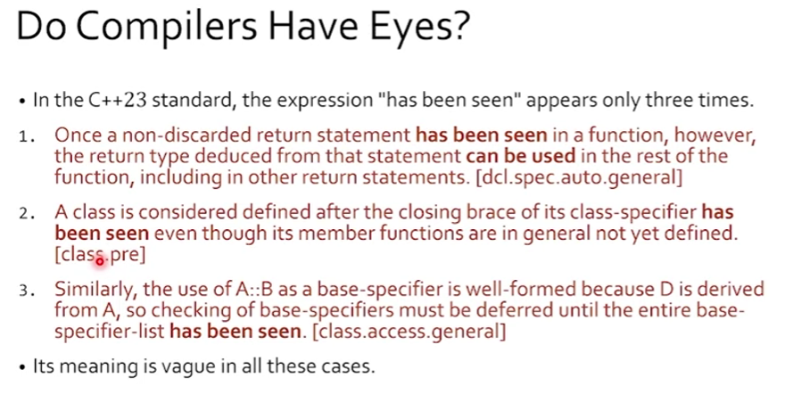
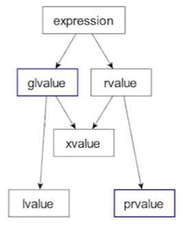
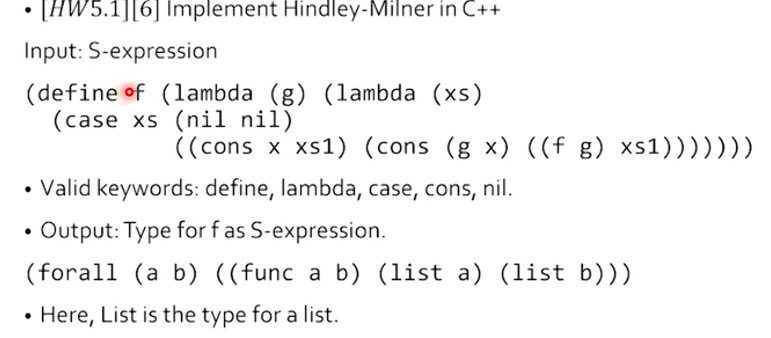

In this course, we will assume that we are enabling a good level of compiler optimizations. We will also work mainly with C++23 and sometimes C++26.

## Lecture 1 : The Very Soul of C++

> Watch the lecture on YouTube [here](https://www.youtube.com/watch?v=X6GVR_3FCHU)

Some jargon that is always thrown around with cpp:

- General purpose a.k.a. the second best language for everything ;)
- Statically typed (tbd) 
- Statically compiled: the compiled -> machine code file is end all be all

The language standard is NOT the final approach to implementation, it ONLY guarantees the translation. It is an agreement between the compiler devs (producers of the language translation implmentation: gcc, clang, msvc..) and the programmers (consumers of the compiler!). Thus, the language standard either translates the program or issues a diagnostic, it should not act like a static analyzer and freely issue false positives.

:::caution
There are caveats, like linker diagnostics being used for missing forward declarations. More on that later. The primary idea is to clarify what the language standard aims to and does NOT aim to do.
:::

### Vectors of development

Consider an implementation of something like a `find_msb`. The most C-like way of doing this is to have a for loop. Since we don't have templates/generics in C, we use a macro on the parameter type:

```cpp
int find_msb(MSB_TYPE msb) {
    int MAX_BIT = sizeof(MSB_TYPE) * CHAR_BIT;
    for (int i = 0; i < MAX_BIT; i++) {
        if (msb & (1 << i)) {
            return i;
        }
    }
    return -1;
}
```

This is okay, but we wish to avoid the loop and here we see the vector of development from **common idiom to machine instructions**. The value of `i` above can be determined using a single `__builtin_clz()` call which is implemented on certain compilers and machines and translates to the equivalent of a `clzw` **single machine instruction**. This is much faster (no branch prediction needed, less memory overhead of loop variable, fewer clock cycles, cleaner code... need I say more:p).

```cpp
int find_msb(MSB_TYPE msb) {
    int total_bits = sizeof(MSB_TYPE) * CHAR_BIT;
    int leading_zeros = __builtin_clz(msb);
    return total_bits - leading_zeros - 1;
}
```

Besides, a use of macro here implies that the either us (the programmers) or the language standards (the compiler devs) have missed something... which takes us to the next vector of development **compiler instrinsics to standard implementation**.

Subtle, but the entire reason why something like `__builtin_clz` exists as a compiler/machine dependent behaviour is that it is useful. It is a natural next step for the programmer to expect from the compiler dev that this feature become a standard language feature instead i.e., from `__builtin_clz` to `template<class T> countl_zero`. Note that the `countl_zero` function can only accept unsigned types. We get:

```cpp
template<typename T>
int find_msb(T value) {
    using U = std::make_unsigned_t<T>;
    const auto digits = std::numeric_limits<U>::digits;
    const auto leading_zeros = std::countl_zero(static_cast<U>(digits));
    return digits - leading_zeros - 1;
}
```

This is okay, but but but, we can always generalize this further. The version below accepts anything that can only take in integral types. We would like to make our function accept ANY non-integral type so long as it can logically find an MSB (*think, atcoder's ModInt*). Concepts to the rescue:

```cpp
int find_msb(std::integral auto value) {
    using U = std::make_unsigned_t<decltype(value)>;
    const auto digits = std::numeric_limits<U>::digits;
    const auto leading_zeros = std::countl_zero(static_cast<U>(digits));
    return digits - leading_zeros - 1;
}
```

:::note
Notice that this version still has some type deduction machinery (`auto` uses the template type deduction machinery inside the compiler anyways!), just that we increase (but continue to restrict) the domain of the incoming input types. Cleanly imposes requirements on the incoming type by adding a layer of indirection.
:::

### Users can insert UB for compiler opts as well (+contracts FTW)


To help us remove the extra LOC, avoid the `int`-promotion and avoid the slightly expensive `cmov`. ~~The grandmaster will sacrifice the exchange:P~~ We will manually insert UB to eradicate the leading path to that point and optimize awat with it any extra case handling.

:::caution
To avoid unleashing cthulhu we add a pre-condition contract to the function
:::

```cpp
int find_msb(std::integral auto value) 
pre(value != 0)
{
    if (value == 0) std::unreachable(); // -> UB, but improves generated asm
    using U = std::make_unsigned_t<decltype(value)>;
    const auto digits = std::numeric_limits<U>::digits;
    const auto leading_zeros = std::countl_zero(static_cast<U>(digits));
    return digits - leading_zeros - 1;
}
```

### Abstract Machine of cpp

- Non-deterministic (different runs may give different answers, both are correct)
- Language standard defines it
- Is not defined everywhere (yay, UB)
- Parameterized. That is, compiler/machine specific behavior of some functionality of the abstract machine must be defined by the compiler devs.

Compiler uses these properties for optimizations mostly on the basis of there being no side-effects

:::important[The so called "as-if" rule]
More formally, the compiler can do anything as long as the observable behavior of the abstract machine (program) does not change. This is a necessary condition but not sufficient.
:::

Observable behavior consists of:

- Order of data written to file.
- Accessing volatile glvalues.
- I/O device interactions.

A lack of side-effects does not necessitate the compiler to start optimizing things away. In the example below, the return value cannot be optimized away since there is an external linkage of the `i` variable and the integer being returned via the return slot might be getting assigned to a volatile glvalue.

:::note[Fun fact]
In C++ we consider the scope of connections that the compiler can see as a *translation unit*, unlike C where the file is considered a translation unit.
:::

```cpp
int check(int i) { /*External linkage*/
    return i * i + i * 8 + 42; // Cant just optimize this away
}
```

:::tip
You can usually think about this by ascertaining if something *could be* assigned to a volatile glvalue.
:::

### UB is a guarantee we give to the compiler, to do absolutely anything

If UB exists in code, not only does the compiler turn blind to that specific LOC, it is free to do anything in the code preceding the location of UB. It can remove everything and consequently lead to an infinite loop as shown below.

This responsibility is on the programmer ONLY, since they have assured the compiler that this is UB and that they guarantee that this UB will never be triggered. Thus an *as-if* behavior is triggered that makes the compiler act as if the UB is never reached. Also, [fun stuff linked here](https://lore.kernel.org/llvm/20250426200513.GA427956@ax162/).

:::important
For the compiler, UB doesn't exist. So if something goes wrong, then the responsibily is on the programmer. The compiler will usually follow a simple mechanism and remove the entire path leading upto UB by assuming that it is unreachable. This will either happen due to the as-if rule seeing no side-effects or because it is on the path to UB.
:::


Another example of the compiler assuming that UB cannot be reached at all.

```cpp
int foo(bool c) {
    int x, y; // x is uninitialized, UB!
    y = c ? x : 42; // The compiler removes the case where we use x at all

    // The above line becomes y = 42, and finally, constant folded to ignore
    // c all the time and just return 42. Thus, foo(true) == 42
    return y;
}
```

### Erroneous behaviour and erroneous values (C++ 26)

```cpp
char a;
char b [[indeterminate]];

char c = a + 1; // c contains an erroneous value, since uninitialized vars are EB not UB
char d = b + 1; // This is UB, since we mark b's uninitialization with the UB attribute "indeterminate"

unsigned char e; // EB
unsigned char f = e; // EB, but now f gets "erroneous value"
assert(e == f); // This evaluates to true since both are erroneous
```

Note that in the above example, `c` can still get optimized away due to the UBness of `b` in the next line `char d = b + 1`; NOT by any fault of `a` or `c` (being undefined/assigned to undefined). EB is allowed to be done, AND recommended by the compiler to diagnose, garbage in garbage out.

### Homework


:::note
Submitting a patch for 1.1 will earn more points
:::

#### Solution for H.W[1.1]

TBD

#### Solution for H.W[1.2]

:::warning
I am not entirely sure if this answer suffices all expectations.
:::

```cpp
#include <iostream>
#include <limits>

template<typename T>
int what(T a) {
    return std::numeric_limits<T>::max();
}

void ujjwal() {
    int *a = nullptr;
    std::cout << what(*a);
}

void lecture() {
    int *a = nullptr;
    std::cout << typeid(*a).name();
}

int main() {
    ujjwal();
    lecture();  

    /* Output seen for Clang and GCC both
    2147483647i
    */  
}
```

[You may check the code generated for this here](https://godbolt.org/z/Ec4cPzqnq)

#### Solution for H.W[1.3]

```cpp
#include <limits>

constexpr int BAD_VAL = -1;

int foo_wrong(int *a, int base, int off) {
    if (off > 0 and base > base + off) {
        return BAD_VAL;
    }
    // Above got removed because overflow can never
    // happen and the condition is treated as false
    // and removed by UB blindness

    return a[base + off];
}

int foo_ok(int *a, int base, int off) {
    if (off > 0 and base > std::numeric_limits<int>::max() - off) {
        return BAD_VAL;
    }
    // Does not depend on the overflow to act, instead
    // the equation base + off > MAX is rearranged!

    return a[base + off];
}
```

[You may check the code generated for this here](https://godbolt.org/z/1Waf8eqc7)

### Extra essential viewing

:::note
At some point I realized that I wasn't very clear on the specific behavior of signed and unsigned overflows while watching Chandler's talk, I took a detour with the [blog on overflow by Ian](https://www.airs.com/blog/archives/120)
:::

#### Rabbit hole: Ian's blog on overflow and some more digging

> [Read it here](https://www.airs.com/blog/archives/120)

Signed integer overflow is considered UB by the standard. So, a C/C++ program that contains signed overflow is considered wrong. Thus, the compiler is free to assume that a given program will not contain signed integer overflow, and if it does anything can be done to it. OTOH, unsigned integer overflow is indeed defined behavior.

*But... why? they are either BOTH UB or BOTH IB/DB right?* No, there are a few caveats with the treatment of a signed integer. Different processors treat signed integer representation of a binary differently. Some use the 2's complement method, while some use 1's complement. Thus, the language standard cannot define a set behavior on signed overflow if the underlying hardware changes. With the unsigned integer, it is obvious that the same bit representation will be treated exactly the same across machines. Thus, overflow can be treated as a "wrap around" (modulo MAX + 1).

*No chance that we can define the signed integer overflow behavior?* Nope, the hardware differences are too wide. By fixing the behavior to one style, we would be antagonizing the users of hardware that is non-conformant to the standard. Plus, far too many optimizations exist due to UB which would otherwise be completely lost. For example here, `if (i + 1 < i) { ... }  // always false if overflow can't happen` can be replaced by the compiler to be `false` directly. If you use flags like `-fwrapv` or `-fno-strict-overflow` then indeed the behavior is fixed at a performance cost. Use builtins like `__builtin_add_overflow(a, b, &result)` (detect overflow safely).

#### CppCon 2016: Chandler Carruth “Garbage In, Garbage Out: Arguing about Undefined Behavior..."

> [Watch it on YouTube here](https://www.youtube.com/watch?v=yG1OZ69H_-o)

:::tip
The summary of the first half of the talk is essentially that *UB is NOT a compiler bug, it is a human violation of the contracts provided by the standard.
:::

That's it, we must start treating UB as a lack of the user's (read: programmer's) knowledge about the working of the language. When they break the contract that the language provides (e.g: dereference a null pointer), they made that error, and as specified by the standard, all bets are off. Sure, UB *could* allow the compiler to optimize the generated asm. However, it is still a valid behaviour even if the final behaviour of the code is not what the user wanted.

### Okay then, lets widen all of our contracts and define all behavior

#### Define all behavior

This problem is simply intractable. consider a function `Node findSink( const vector<Node*>& graph )`. If this is defined in a way that recurses to find a node that is a sink, then upon being given a graph which is cyclic any of the following could happen:

- The recursion forces the stack to grow to an overflow, and it gets killed by the OS
- The implementation is optimizable to a tail recursion, which causes there to be an infinite loop.
- Some node pointer corrupts due to the growing stack and a dereference goes on to hit a guarded page, leading to a segfault.

Can you define this behaviour? No you cannot, it has to be platform/hardware/compiler defined. Matter of fact, all three cases are (usually) possible to hit in most cases so the result is non-deterministic across different runs of the binary. Remember, UB does not guarantee consistent behaviour across runs -- all bets are off.

#### Widen all contracts

In the previous example, the only way to do that would be to add a runtime pre-condition contract that first processes the graph to find a cycle. This needs extra memory, this needs extra runtime performance cost. Not all users are going to be happy with that. In fact, such a pre-condition might be essentially impossible to write. To add a pre-condition that disallows inputs going into an infinite loop is reducible to solving the halting problem. So, we are stuck with a logical bottleneck to eliminating UB.

### Pay for what you use: Narrow contracts when we need them, are okay

Principles for narrow contracts:

- Checkable (probabilistically) at runtime
- Provides immense value as a trade-off
- Should not break existing code (or coding practices that are widely accepted)

TBD

#### CppCon 2017: Piotr Padlewski “Undefined Behaviour is awesome!”

TBD

## Lecture 2: Strings

:::tip
THE best and greatest example of generic programming are string...
:::

### History

Whether you write a "hello world" program in 2025, in the most bleeding edge module and `std::print` syntax or in the 1983 `std::printf` version; the string literal continues to remain common. In fact, the C-style string literals put withing double quotes are used till date. Why?

### What are strings exactly?

Initially, the notion to "pass" strings around would require some way of knowing what the string was. Imagine encoding strings with their length attached as a prefix to them. This would require some kind of a compiler magic type that would define the interaction of this string type with all other types in the standard.

Instead, the compiler devs of the time came up with a brilliant idea. Null-terminated strings and treating string literals as `const char*`. In fact, EVERY suffix of the string was automatically another `const char *` by design, and this only took one extra character worth of memory to null-terminate itself thus, not requiring a prefix-ed length. This solution is really cool, there are often caveats like the one shown below.

```cpp
auto t = "Hello, World";
static_assert(sizeof(t) == 8); // t is a const char *
static_assert(sizeof("Hello, World") == 14); // the passed in thing is a null-terminated string literal
// This is because the string literal would be stored as an array of bytes in the .rodata section of
// the code. The sizeof thus finds the number of elements present in this array including the null-term
// When we store the const char* in a variable the variable can simply point to it now.
```

### Suprises and C-style strings

Seemingly "safe" and "common" functions like the `strcpy` function are in fact VERY unsafe. This is because passing in a non null-terminated string into the src ptr will make the implementation endlessly look for a null termination character that makes the program behave badly.

#### Band-aid solution

Make a "safe" `strcpy` which also accepts a limit value; i.e., `strncpy`. Really? We still can't make a `strnlen` right? What would that do? Give up after "n" characters? In fact, this still doesn't help improve the security at all!


Begs the question, why do we not get guarantees with our C-string API (if you can call it one). Simple, the C-string has no length invariant in it. We can add invariants simply using...

#### OOPS `:O`

We can preserve object invariance, by writing length as a private member of the string that can only be modified by the members of the object. Specifically, encapsulation is what allows this.

There are MANY (read: MANYYYYY) string classes that have been written. For this reason, we abandon the idea to rewrite the string class any better than the current alternatives to `std::string`; we study `std::string` and how it is built.

### Deep dive into the `std::string` class

Fundamentally similar to what `std::vector<>` does. A pointer to manually managed memory which contains the real payload. And a `size` variable to track the real length alongwith a `capacity` variable to track the remaining allocated buffer on the managed memory. More convenient is that the string class itself automaticall manages memory, and owns the buffer.

:::warning
Counterintuitively, we still store a null-terminating character at exactly `buffer[size]`. This is for the reasons of backwards compatibility. Infact, `string.c_str()` returns a `const char*`.

Also, please don't use `string.data()`, since it returns a simple `char*` allowing the internal pointer to be modified without encapsulation (DANGEROUS).
:::

#### Suspicious stuff here

Yes, the string class owns the buffer. Allocations on the buffer will be done on the managed memory... usually the heap. What happens if we make these allocations BEFORE `main()`? Worse, what happens if there's a `bad_alloc()` BEFORE `main()`? The example below shows a case where this is indeed possible.

```cpp
static const std::string s =
    "String so big that it won't "
    "fit as a simple list of symbols. "
    "Proceed with heap alloc :("

void foo(const std::string& arg) {
    /* blah blah with arg */
}

int main() {
    foo(s); // heap alloc seen BEFORE main()
    // leads to a jmp __abrt() in the asm. BAD
}
```

Okay, let's do a band-aid fix. What if, instead of a `static std::string`, we use a `static const char*`? The actual payload "String so big..." will be stored in `.rodata` and the the pointer `s` itself is stored on `.data/.bss`. But there's something even more annoying here.

Any time `arg` receives a `const char*`, it must temporarily materialize it in the body of `foo()` for each call. Every call of `foo()` does an alloc and then a dealloc after arg goes out of scope. This is a serious performance penalty.

#### `std::string_view` solves this!

It is a non-owning pointer to a string. Thus, the following code does not have any heap allocations before main, and calling `foo()` does not temporarily materialize heap-allocated objects every call.

```cpp
static constinit const std::string_view s =
    "String so big that it won't "
    "fit as a simple list of symbols. "
    "Proceed with heap alloc :("

void foo(const std::string_view arg) {
    /* blah blah with arg */
}

int main() {
    foo(s); // No heap alloc, no performance penalty
    // The actual owner is the static storage duration
    // Essentially, .rodata
}
```

:::tip
We throw in a `constinit` qualification to our `static std::string_view`. This guarantees that if the compiler is unable to use compile-time initialization for this, it will throw an error. Essentially, this initialization will be done before any dynamic initialization; and will error out at compile-time if it is not possible to do so.
:::

### Deep dive into `std::string_view`

It simply contains a pointer to the to the beginning of the view, alongwith a `size` that denotes the size of the view. However, the pointer to the beginning of the view does NOT own the memory being pointed to, and is thus, not responsible for the memory management of the same.

#### Suspicious stuff here (again!)

Unfortunately, the `std::string_view` (and other classes like it) pretends to be a value. It isn't. What happens when the value dangles? Can a value itself be an xvalue? Logically, it shouldn't. Consider this:

```cpp
std::string_view sv_bad = std::string("Hello World");
```

`std::string("Hello World!")` is an xvalue since in the very next line, this value reaches the end of its lifetime. But `sv_bad` must bind to it. This breakes value semantics! Many other classes exist with value semantics but _can_ dangle.

:::tip
A Rule of Thumb for `view`-like types

Use `std::string_view` in the following cases only:

- As a function parameter: `std::string identity(std::string_view sv) { return sv; };`. This is a safe option since the actual owner is outside the scope. The caller guarantees no-dangling.
- As for-loop initializers: `for (std::string_view e : elems) { /**/ };`. Again, the owner of each e is outside the scope of the for-loop.


If you see `std::string_view` anywhere else, beware! Double check the lifetimes.
:::

### Performance notes

#### CoW

Often, there are copies of the same string in the program, even in the simple case shown below. The same string "Hello\0" is stored in memory twice. Wasting the memory and some performance on extra allocations and deallocations.

```cpp
std::string s1 = "Hello";
std::string s2 = s1; // Invokes a copy constructor.
```

A typical optimization possible here is "CoW" a.k.a. "copy on write". Only increment refcounts on a control block that actually owns the string. When something is edited, the refcount reduces and the actual allocation of a new control block is done. Otherwise, only refcounts are added or subtracted and the string points to the control block.

This doesn't solve everything though. The memory savings come at the cost of an extra pointer indirection. The fewer allocations comes at the cost of thread safety issues and atomic operation requirement on the control block's refcount.

However, there is a reason that CoW strings aren't in the standard anymore: **pointer invalidation**. Very basic operations can invalidate pointers with CoW string!

```cpp
cow::string s("str");
const char* p = s.data();

{
    cow::string s2(s);
    s[0] = 'S'; // CoW triggered!
}

// No guarantee that the p is still valid due to
// reallocation
// For non-CoW strings, p would have been valid.
std::cout << *p << '\n';
```

Editing a single character in a copy of the original string, invalidated the pointer to the original string! This is why the standard in C++11 changed and forbade the `operator[]` from invalidating poiners to the string.

#### SSO

Well, the string block itself has a pointer and two unsigned ints. That consumes around 24 bytes (compiler/hardware dependent behaviour). Why not store really tiny strings (i.e., within 24 bytes) on the stack? This *could* be implemented as a union with size checks ensuring the right dispatch. However, GCC strings (ver >= 5) store the `std::string` as shown below.


### A final implementation wrinkle

Since we can store "x bytes" in memory, different strings like UTF-8 and UTF-32 might need repeated implementations. Matter of fact, the 89 public member functions (as mentioned in the video) would have to repeated for each. Enter: generic types!

We will make a `basic_string<CharT>` type that cares only about bytes. And then all other types become conveniences, `using string = basic_string<char>` and `using u16string = basic_string<u16chat_t>` among others.

Moreover, to decouple characted-level semantics (how are characters compared? how does `to_upper()` work?) from the container-level semantics (manage the data pointer, size etc); we pass in another policy class `basic_string<CharT, Traits>`. This can allow us to write custom traits that can, for example, use vectorized instructions for certain traits, or obfuscate credit-card numbers automatically while reading them; etc.

:::caution 
Allocation of a single character is not a trait of the char itself. It is that of the container since that determines WHERE will the character be allocated.
:::

Which means that even the allocator must be separated! The final, real class becomes `basic_string<CharT, Traits, Allocator>`. This is super important because often, the default heap-based allocators might not be the best for a given workload; and swapping out a different allocator would be as simple as passing in a different `Allocator` templ arg.

### Homework

#### Write your own CoW-string template class. Measure advantage over `std::string` on some benchmarks
TBD

#### Write a template class string_twine for O(logN) concatenation of several `string_view`s
TBD

#### Compilers are optimizing `std::string` worse than `std::vector`. Investigate [here](https://godbolt.org/z/Tfh6zfa6P)

TBD

### CppCon 2016: Nicholas Ormrod “The strange details of std::string at Facebook"

> [Watch it on YouTube here](https://www.youtube.com/watch?v=kPR8h4-qZdk)

GCC (version < 5) string is actually only a single data pointer... Where are the other details then? BEHIND the actual payload of the string! Moreover, for the empty string, GCC maintains a global variable that is a 25 byte array of zeroes that is the actual empty string.


Andrei Alexandrescu suggested the fbstring, which does SSO (with the data/size/capacity) triplet in the stack now. It stores the remaining capacity at the end. The beauty of this design is that when all 23 bytes are occupied, and the 24th byte is the null-terminator. The value of the remaining capacity doubles as the null-termination: 0!!

I don't even know how to describe the insane jemalloc + kernel + null terminator UB bug. I'll just rewatch the video from that timestamp [here](https://youtu.be/kPR8h4-qZdk?si=K5_Ry-JRWi_lWhXf&t=1260). 

Conclusion? Strings are a lot richer than what we imagine:) . And that the next great string implementation will come with its own trade-offs.

## Lecture 3: Overload sets

:::tip
The first step is to get the algorithm right. The second step is to figure out which sorts of things (types) it works for:p
:::

### Illustrative example: Raising a number to a power

We intend to get the algorithm right first (binary exponentiation)

```cpp
unsigned nth_power(unsigned x, unsigned n) {
    unsigned acc = 1;
    if (x < 2 || n == 1) return x;
    while (n > 0) {
        if (n & 0x1) {
            acc = acc * x;
            n -= 1;
        }

        x = x * x;
        n >>= 1;
    }

    return acc;
}
```

#### Naive generalization: templated type of "x"

```cpp
template <typename T>
T nth_power(T x, unsigned n) {
    T acc = 1;
    if (x < 2 || n == 1) return x;
    while (n > 0) {
        if (n & 0x1) {
            acc = acc * x;
            n -= 1;
        }

        x = x * x;
        n >>= 1;
    }

    return acc;
}
```

While this solutions "feels" like it is more generic than the hardcoded unsigned type. It fails due to two glaring issues. First, is the issue of the `T` which accepts just about any type. However, not all types can support the operations that `nth_power` needs for `T`, like the initial value of `acc` isn't necessarily `1`.
For example, a `Matrix` class would require `acc` to be an identity matrix instead of a scalar value. Second, the check `x < 2` doesn't logically work for `signed` types either (`-2 ^ 10 != -2`).

#### Improving the naive generalization

To improve this, we assume is that all `T` will have an identity type associated with it (`id<T>`).

```cpp
template <typename T>
T nth_power(T x, unsigned n) {
    T acc = id<T>();
    if (x == acc || n == 1) return x;
    
    /*Same as before*/
}
```

This is a really strong assumption though. You can't assume global functions to be required unless they are extremely standard. For example, it is alright to require a `.begin()` since it is very idiomatic in C++. But assuming the existence of such an odd function is not.

Can we solve this by making `id<T>` a part of the type_traits? Well this runs into a similar issue. It is better than having a global requirement and it also decouples the existence of the identity from the type itself and puts it into a `Traits` template parameter. But this isn't how the library solves its problems. Think: Where else do we need an identity type in the standard library, how does it solve the identity issue?

#### Inspired from `std::accumulate`

The standard handles this by passing in the identity value as a function argument to separate these concerns from the type itself.

```cpp
template <typename T>
T nth_power(T x, T acc, unsigned n) {
    while (n > 0) {
        if (n & 0x1) {
            acc = acc * x;
            n -= 1;
        }

        x = x * x;
        n >>= 1;
    }

    return acc;
}
```

Also, to improve the quality of usage, we can define full specializations of more commonly used types like `unsigned`:

```cpp
template <typename T>
T nth_power(T x, T acc, unsigned n) {
    /* Same as before */
}

unsigned nth_power(unsigned x, unsigned n) {
    if (x < 2u || n == 1u) return x;
    return nth_power<unsigned>(x, 1u, n);
}
```

:::tip
Notice how the "clean" part of the algorithm gets separated out into a generic function with very little casework. The casework that is type specific, gets handed out to full specializations of wrapper calls.

This is why the building blocks of generic programming are these **overload sets**!
:::

We notice examples of overload sets being used in the std library all the time. As shown here, the overload sets of the comparison function of `const char*` with `basic_string<...>` avoid an extra copy of the string literal.


### General principles for the design of overload sets

#### Examples of good design

Different but related types: Ensures consistent behaviour and ensures that the compiler is not creating a temporary `std::string`.

- `void foo(const char* s)`
- `void foo(std::string s) { Foo(s.c_str()); }`

Different number of parameters

- `auto s1 = twine("Hello", name).str();`
- `auto s2 = twine("Hello", name, " ", surname).str();`

Optimizations

- `void vector<T>::push_back(const T&)`
- `void vector<T>::push_back(T&&)`

#### Some rules of thumb

- A person shouldn't need a deep understanding of the C++ overload resolution or of the C++ type system to simply use the function.
- Noone should be forced to do deep overload resolution in their head.
- Each overload set should **roughly** do the same thing.
- Try to encode requirements of the generic function using `requires` constraints.
- You may create overload sets using `requires` clauses on each type. SFINAE will pick the appropriate overload, and if nothing works, each failing condition will be displayed which is good for diagnostics.

### Fun fact function name mangling

Look at the overloads of `Foo` shown below. They should be mangled to the same name and lead to a redifinition or ambiguity error. Instead, this is perfectly normal and behaves as expected.

```cpp
template <typename T>
requires (sizeof(T) > 4)
void Foo(T x) {}

template <typename T>
requires (sizeof(T) <= 4)
void Foo(T x) {}
```
 
This works because according to the standards two functions with the same name are considered to be equivalent iff:

- They are in the same namespace.
- Their parameter sets are equivalent.
- **Their trailing requires clauses are equivalent.**

The compiler treats the requires clause as an integral part of the function interface but NOT as part of the mangled function symbol. This is done by simply checking for viable overloads by the compiler. In this case, the two versions are for mutually exclusive types. Thus, **for a given `T`** only one definition is valid. So even though `nm` should in theory show the same mangled name, the linker doesn't care since for a given type only one type would be valid.

#### Compiler doesn't know that a condition is "more restrictive"

If an overload requires a condition $A$ to be true, while another overload requires a condition $B \sub A$ to be true. The compiler will find both sets to be viable overloads but it won't know that the latter is more restrictive (*it is easy to confuse this with specializations of a template*).

In fact, using concepts is even better here! Complex constraints can be used to check *validity* of an expression as opposed to the boolean evaluated values.

```cpp

template <typename T>
consteval int somepred() { return 67; }

// simple constraint
template <typename T>
requires (somepred<T>() == 42)
bool foo(T&& lhs, T&& rhs);

// complex constraint
template <typename T>
requires requires(T t) { somepred<T>() == 42; }
bool foo(T&& lhs, T&& rhs);
```

The first one will evaluate the requires clause at compile time and emit false. The second one however simply checks that the enclosed expression is indeed valid. Since the expression is valid (regardless of its boolean-ness), the clause is satisfied!

:::caution
I don't think I am clear on the four types of requires clauses and how they differ. Honestly, the syntax is throwing me off a bit so I will return to this later using maybe some other video!
:::

### concepts

There are 4 types of requires expressions: simple, type, compound and nested. To make these long `requires` clauses more readable and clean, C++20 introduces `concept`. These concepts can be given names, making their intent very clear. It is a compile-time predicate, so it doesn't need to be *called* like a function. The `concept` itself is a value!

:::important 
Recursive concepts and constraints on concepts by other predicates are not allowed. This is *probably* done to disallow two sources of Turing complete programs (meta programming) by the committee.

We can still put other predicates on a concept using conjuction and mitigate it, but explicit recursion is simply disallowed on concepts.
:::

Moreover, we can constrain member functions and even constructors inside a class using concepts/requires. Compiler can also partially order concepts to help pick the "most restrictive" viable overload set. How does compiler understand partial specialization? How does it understand that `Ord` is more restrictive than `Ord || Void`.

### Compiler's understanding of `concept`'s constraints

All `concept`s are a series of atomic constraints joined by logical operations (`||`, `&&`; etc.) **with the short-circuiting rules working as usual**. The compiler is able to determine a `subsumes` relation between the constraint sets of two viable overload sets. The set that subsumes all others is automatically the most restrictive viable overload set.

Ideally, we would have preferred to see the subsumes condition to be that: `P subsumes Q <=> (Q => P)`. However, we are not in the real world, and semantic meaning is often going to be too hard for the compiler to determine; leading to false negatives on ill-formed types. In the old RFCs for `concepts` they didn't just account for syntactice, but also semantic requirements using keywords like `axioms`.

### Homework

#### Design a realistic overload set for generic function `nth_power` using constraints. Account for integers, floats and matrices.

TBD

#### Try to figure out what is going wrong [here](godbolt.org/z/jKq1GG7hr)


### Suggested reading

I have noted them down in decreasing order of relevance for myself.

#### Nicolai Josuttis, Back to basics: concepts, Cppcon 2024

:::caution
I have described `requires` as an expression and as a clause without giving much thought to it. However, there is a distinction which I was not aware of until I was halfway through the talk:p

```cpp

// Here, the requires expression is "defining" requirements
template <typename CollT> 
concept HasPushback = requires (CollT c, CollT::value_type v) {
    c.push_back(v);
}

// Here, the requirements clause if defining the actual constraint
template <typename CollT, typename T>
requires HasPushback<CollT>
void add(/**/) {}

// The expression and the clause can also be combined in a single line
void add(auto& c, const auto& v)
requires requires { c.push_back(v); }
{ /**/ }
```

I have marked the `requires` expression and clause above to distinguish between them.
:::


Shown below, options A and B are both equivalent and result in the same thing. Option B is simply less wordy and more idiomatic C++. Also, when we write `HasPushback T`, notice that `HasPushback` needs 1 template parameter, but here it has none. The compiler simply puts the template argument in front of it in the leftmost position. So `std::is_same_as<int> T` would make the compiler evaluate the syntactic correctness of `std::is_same_as<T, int>`.

```cpp
template <typename CollT>
concept HasPushback = requires (CollT c, CollT::value_type v) {
    c.push_back(v);
} 

// Option A
template <typename CollT, typename T>
requires HasPushback<CollT>
void add(/**/) {}

// Option B
template <HasPushback CollT, typename T>
void add(/**/) {}
```

Concepts can often emit bad diagnostics. Imagine a spelling error in `concept HasPushback` that looks like:

```cpp
template <typename CollT>
concept HasPushback = requires (CollT c, CollT::value_type v) {
    c.pushback(v); // INCORRECT: push_back is the right spelling
} 
```

Now, if there was a less restrictive overload of `add()`, say, with no `requires` clause and a `c.insert(v)` in it; the compiler would complain that `CollT does not have insert()`. This would not lead us to the right source of error. To prevent this, we should put `static_assert`s alongwith the concept. Since the concept is a compile-time predicate, simply adding `static_assert(HasPushback<std::vector<int>>)` would help us locate the error easily.

With the "almost always auto" motto, a lot of the generic function templates can be abbreviated as:

```cpp
// Option A
template <typename T1, typename T2>
void foo(T1 a, const T2 b) {}

// Option B
void foo(auto a, const auto b) {}
```

Option B is syntactically equivalent to Option A. However, there is really nice by-product of this design. Since Option B is an abbreviation of Option A, which uses templates; the linker does not need to see an `inline` qualification. We can combine concepts directly with the auto type deduction, by introducing it as a type constraint, shown below (Option B is equivalent to A):

```cpp
// Option A
template <HasPushback T1, typename T2>
void foo(T1 a, const T2 b) {}

// Option B
void foo(HasPushback auto a, const auto b) {}
```

We can also add requires clauses even here, using something like `decltype(a)`. But, the following code does not compile:

```cpp
void add(auto& c, const auto& v)
requires HasPushback<decltype(c)>
{}
```

This fails because `decltype(c) == std::vector<>&`. While its perfectly legal to call `.push_back()` on a `std::vector<>&`, it is not valid to do `std::vector<>&::value_type`! We can work around this using either `std::decay_t` or `std::remove_cvref_t` on the returned value of `decltype()`. In fact, we can put this into the concept itself:

```cpp
template <typename CollT>
concept HasPushback =
    requires (CollT c, std::remove_cvref_t<CollT>::value_type v) {
        c.push_back(v);
    }
```

:::tip
Even though we are more used to `std::decay_t` to remove all const/volatile qualifiers; it is now better to use `std::remove_cvref_t` instead, since `std::decay_t` converts arrays to pointers, which might not be the intended effect.
:::

What about concepts for multiple parameters? Something like `CanPushback<CollT, T>`? That is alright, we can write this as seen before, and it works as a trailing clause of auto-functions too. Both options A and B compile and work well.

```cpp
template<typename CollT, typename T>
concept CanPushback =
    requires(CollT c, T v) {
        c.push_back(v);
    }

// Option A
template<typename CollT, typename T>
requires CanPushback<CollT, T>
void add(CollT c, T v) {}

// Option B
void add(auto c, const auto& v)
requires CanPushback<decltype(v), decltype(v)>
```

In general though, it is always better to have coarse-grained concepts. I.e., not making a new concept for each new thing and simply making a general-purpose concept with multiple requirements.


Here, some information on syntax: `{c < c} -> std::convertible_to<bool>` is checking, that the expression `{c < c}` is **valid**, and by putting the expression in curly braces, we turn this simple requirement to a *compound* requirement. The compiler then sees the result of `{c < c}` and passes the type of that result as the **first** template argument of the trailing concept, and then it uses the predicate value of the trailing concept; something like: `std::convertible_to<decltype({c < c}), bool>` (this is only a representative of what compiles by the way).

We could go a step further and force the compiler to check for non-throwing behaviour too. Like so:

```cpp
template <typename CollT>
concept HasSwap = 
    requires (CollT c1, Coll c2) {
        { c1.swap(c2) } noexcept -> std::same_as<void>;
    }
```

This checks:

- `c1.swap(c2)` is well-formed.
- `c1.swap(c2)` never throws.
- The return type of `c1.swap(c2)` is `void`.

:::important
A common gotcha: putting `noexcept` in the requirement **does NOT** make the code `noexcept`, it is only a compile-time predicate.
:::

#### Andrew Sutton, Concepts in 60, Cppcon 2018

#### Titus Winters, Modern C++ design (2 parts), Cppcon 2018

## Lecture 4: Name lookup and overload resolution

As seen in the last lecture, the building blocks for generic programming is an overload set. Clearly, the fact that we overload something; we seek to associate a name with a *semantic meaning*.

```cpp
auto nth_power(std::integral auto x, unsigned n) -> decltype(x);
Matrix nth_power(Matrix x, unsigned n);
```

Above, both overloads of `nth_power` are implemented differently. They operate on different mathematical elements entirely. But, since they are semantically similar; they can logically share the same name. In the language standard, we use language grammar rules to define the formal syntax. **C++ is mostly context-free** becase in most of the grammar rules `A : B`, the expansion will almost always have a single non-terminal on the left-hand side (`A`). Which means, an `if` is always `if` and `for` is always a `for`, since the context in which it is called does not change its behaviour.

Here's the thing though. The C++ compiler does not blindly apply the syntax alone. The example below is syntactically correct since it satisfies the language grammar rules (a parse tree *can* be constructed):

```cpp
auto *p = new int;
delete delete delete p;
```

However, even though it is syntactically correct, **it fails type checking** with an error like `type void argument given to delete, expected pointer`. But type checking is not done by the CFG (context-free grammar). This is just how there can exist grammatically correct sentences that have no proper semantic meaning. But, we do have context-dependent constructs. Take for example the empty square brackets `[]`. The meaning of these brackets changes depending on what comes before or after them. In case of `delete [] ...`, the square brackets are used to signify which `delete` expression is being used. Whereas, in case of lambda expressions, they denote capture lists. Thus, the *parse* works with the *semantic analyzer*.

### Overload resolution rules


:::important
Most of our discussion will be from step 1 to 2. The process of going from all overloaded names to the set of candidate is the most complex and also really important. This is where *name lookup* actually happens.
:::

#### Overloaded Names -> Candidates

```cpp

void foo(int); // 1
struct foo{ foo(int); }; // 2

//...

foo(0); // What happens here
foo{0}; // What about this?
```

Well, `foo(0)` is obviously a function call! So `foo(0)` goes to option `1`. But, the second option is a compilation error due to ambiguity. Are we dealing with a function or a list initializer? The compiler first tries to treat `foo` as a discarded function pointer, tries to part `foo{` and simply errors out! It never even gets to SFINAE into struct.


Above, an edge shows name incompatibility. For example, namespace and function cannot have the same name. struct and function although can have the same name. When the compiler does see overloads. It does quite a few things (non-exhaustive):

#### Is the declaration of the overload already bad?

```cpp
int b(int);
const int b(int); // ERROR
```

Since we can't overload a function based solely on its return type, the compiler errors out here. This is an error because when `b()` is called in the code, the compiler has no way of knowing which overload to call. It can't just see *how* you will look at the return value. However in the next example:

```cpp
int b(int);
int b(const int); // OK
```

Everything works. Infact, the compiler realizes that there are actually no overloads. Since the top-level const qualifier is ignored in the signature, both these functions are exactly the same! The declaration is treated as a redundant one.

:::tip
Think in terms of the caller when looking at stuff like this. Does the caller *really* care if the function treats the parameter as `const`? Also, remember that we are talking about a top-level `const` here, the function gets its own copy of the passed in parameter. `const` beside a reference/pointer is a low-level `const` since we pass an alias to the original object. The mangled name generated in this case is different.
:::

Similarly, overloading with noexcept is prohibited too. Overloading static and non-static version within a struct scope is also prohibited. There are other examples too!

#### Scopes change behaviour

Different scopes have different allowances from the compiler (see below).

```cpp
namespace A {
    using A::i;
    using A::i; // OK: double decl
}

void foo() {
    using A::i;
    using A::i; // ERR: double decl
}
```

The image below captures the essence of this, while the `namespace` scope allows a lot, the `block` scope on the other hand is very restrictive in its rules. The lookup will behave differently in different scopes due to the restrictions.


#### Qualified v/s unqualified name lookup is different

A fun example of this is shown:

```cpp
namespace B { int x = 0; }
namespace C { int x = 0; }

namespace A {
    using namespace B;
    void f() {
        using C::x;
        A::x = 1; // QUALIFIED LOOKUP: sets B::x (which is using B's x)
        x = 2;    // UNQUALIFIED LOOKUP: sets C::x; (unqualified happens inside out from scope)
    }
}
```

#### Single search (simple  lookup) and base lookup

```cpp
namespace N { int x = 1; }

int main {
    int N = 0;
    N += N::x; // OK!
}
```

The compiler is quite smart here. When evaluating the expression `N += N::x` it needs to lookup both the names on either side of `+=`. Now, on the left `N` is anything that can be assigned to (more specifically an object with `operator+=`). It finds the local `N` as a viable candidate. Meanwhile, on the right, the compiler sees `::` and disqualifies non-type names. The compiler will now search for something like a namespace or class. Thus, even though the `int N` is closer in scope, the compiler still discovers the `namespace N` and is able to access the `x` variable there.

Simple lookup (single search) in a scope `S` for a name `N` at a point `P` in the source code finds all declarations of `N` in that scope (it keeps going up the scope too to find others). Meanwhile, in base lookup for a name `N`, a set `S` is constructed with the set of declarations and subobjects. For example:

```cpp
struct A { int x; };
struct B { double x; }
struct D : A {};

struct C : public A, public B { }; // 1
struct E : public A, public D { }; // 2
```

Option 1 errors out due to ambiguity. The compiler tries to find the valid declaration of `x` inside the class scope of `C`. It does a base lookup and for every base, it makes a candidate set: `{ A in C, B in C }`. This is called a set of sub-objects. When the time comes to lookup an un-qualified name (`x`), it sees that there are two possible candidates for `x` and declares that the program is ill-formed.

On the other hand, even though for Option 2 we have a defined result for an un-qualified lookup of `A`

:::caution
I wasn't able to properly understand this part. Will probably go through this a few more times. Consider this specific section and the notion of semantic process incomplete.
:::

#### ADL

Typical example is too look at the left-shift operator. Something like `std::cout << "Hello\n";` can be deduced as `operator<<(std::cout, "Hello\n");`. However, the operator would have to belong to the `std` namespace: `std::operator<<(...)`. But compiler can't just deduce this from `std::a << b`.

ADL a.k.a. Koenig lookup solves this. The solution goes:

- The compiler first looks for the function in the current and all enclosing namespaces.
- Failing which, it then looks up the function in the namespaces of the arguments.

```cpp
namespace N { struct A; int f(A*); }
int g(N::A* a) { int i = f(a); return i; }
```

Here, inside `g(...)`, The compiler first sees in the current scope if there is a function `f(...)` using simple unqualified lookup. That fails (because there isn't one here). Next, the compiler looks at each argument and their associated namespace, and then searches for a definition of `f(...)` in `N`.

```cpp
typedef int f; // DISABLES ADL!!
namespace N { struct A; int f(A*); }
int g(N::A* a) { int i = f(a); return i; }
```

In this case, the compiler indeed finds a definition of `int f` in the current namespace due to an unqualified lookup. This completely stops the compiler from trying ADL and ever finding `N::f()`. The compiler translates the line to a function-style typecast `int i = int(a);`. Of course, if the `struct A` cannot be type-casted to an `int`, this fails.

:::caution
Be careful though, there is no SFINAE to save us here. It's not like if the unqualified lookup provided candidate is found to be incompatible, the compiler will try ADL. It will not, and it will fail! 
:::

Even funnier is the next example. **It does not work!**. It fails with really bad error messages too. Think about it in terms of what the parser would see when it sees the following tokens: `f`, `<`, `int`, `>`?

```cpp
namespace N {
    struct A;
    template <typename T> int f(A*);
}
int g(N::A* a) { int i = f<int>(a); return i; }
```

Yes, the compiler indeed thinks that this is an `operator<` after parsing until `f<`. The compiler has absolutely no way of knowing that `f` is supposed to treated as a template type! Simply adding any templated definition for `f` (regardless of the actual function signature), makes this work normally. So something like this works:


```cpp
namespace N {
    struct A;
    template <typename T> int f(A*);
}
template <typename T> void f(void);

// Works now
int g(N::A* a) { int i = f<int>(a); return i; }
```

The next example will make the case of unqualified lookup a little clearer.

```cpp

namespace A {
    struct std {
        struct Cout {};
        static Cout cout;
    };

    void operator<< (std::Cout, const char*) {
        ::std::cout << "World\n";
    }
}

int main() {
    using A::std;

    ::std::cout << "Hello"; // Prints "Hello"!!
    std::cout << "Hello"; // Prints "World\n"!!
}
```

`using A::std` binds the default "unqualified" `std` lookup to `A::std`. This is perfectly valid syntax. The only way to actually use the standard `cout` is to fully qualify it by writing `::std` which finds the right namespace (instead of the struct).

:::tip
Lesson learnt: If you wish to ABSOLUTELY clear on what you are using, please fully qualify your names!
:::

#### ADL and hidden friend

A very powerful feature is that if a member function is declared inside a class, *it can only be found via ADL*.

```cpp
struct X {
    friend bool operator== (X lhs, X rhs) {
        return lhs.data == rhs.data;
    }
};

struct Y {
    auto operator X() const { return X{} };
};

X a, b; Y c, d;
(a == b); // OK
(c == d); // FAILS
```

Imagine if such a facility didn't exist. `(c == d)` would have compiled only because it can get typecasted to `X`. In the `(a == b)` line, the compiler looks at it as `operator==(a, b)`. Then, since there is no `operator==()` in the current scope. So, the compiler does an ADL and is able to find `X::operator==()` instead as a hidden friend.

### Selecting candidates

We must note that although template instantiation usually happens AFTER the entire process of overload resolution. Sometimes, the compiler will do template instantatiation to select the candidates. Like, for a function `bar` that may have some templated version, it might instantiate the template to see if it is a viable candidate.

### Check viability of candidates

An example of viability is to check for number of paramters for a function overload. For a function call with `m` parameters, an overload is selected if it has *exactly* `m` parameters. An overload with less than `m` parameter is not selected unless it has an ellipsis in the arg list.

```cpp
foo(int); // Not viable
foo(int, ...); // viable
foo(int, float, int = 0); // viable
foo(int, float, int); // not viable

int main() {
    foo(1, 2);
}
```

### Selecting the best candidate

The compiler buids a chain of conversions. The priority is given (in the decreasing order) rougly as:

- Standard conversions
- User-defined conversions (like a constructor or conversion operator)
- Ellipsis (...)


When there are two valid chains of conversion, intuitively the shorter chain wins. For example:

```cpp
struct A {
    operator int();    // 1
    operator float();  // 2
}

int x = A{}; // CALLs 1
```

One chain of conversion for `int x = A{}` would have been to do `A::operator float()` (user-defined constructor) to `Float-to-int conversion` (standard conversion). The other chain of conversion is to do `A::operator int()` instead. The latter is preferred since it is a shorter chain. This is so interesting, because somehow the compiler *is* using information from the left hand side of the expression.

In the ICS (implicit conversion sequence), there cannot be more than one user-defined conversions according to the standard. Lets see an example:

```cpp

struct S {
    S(long) {}
    S(T) {}
};

struct T {
    T(int) {}
}

void f(S) {}
int x = 42;
foo(x);
```

Here, there are two ICS's. One is from an `int` to a `long` (standard conv). Then, from a `long` to an `S` (user-defined constructor). The other one is from an `int` to `T` (user-defined constructor). Then, from `T` to `S` (user-defined constructor again). `T` loses to `long`, and the first chain is selected.

Finally, **if there is no candidate, or two equally good ones; the code is ill-formed**. The semantic process so far (in order) are:

- Alias substitution
- Name lookup
- Over resolution

The processes together form **Name resolution**. This is followed by template instantiation, type deduction etc.

:::important
Type deduction and template instantation can trigger new name resolution down the line. An example of this:

```cpp
template <typename T>
T min(T x, T y) {
    return x < y ? x : y;
}

template <typename T>
T min(T x, T y, T z) {
    auto t = min(x, y);
    return min(t, z);
}
```

Here, `min(1, 2, 3)` does name resolution to find that there is only one viable candidate (by number of parameters `T min(T, T, T)`). Then, template instantiation triggers and the first line in the function's code block is `auto t = min(x, y)`. This again triggers name resolution to find the only viable candidate (again, by number of parameters `T min(T, T)`).
:::

### Homework

#### (1) Characterize the following on the basis of C++23

```cpp
template <class T1, class T2>
struct Pair {
    template <class U1 = T1, class U2 = T2>
    Pair(U1&&, U2&&) {}
}

struct S { S() = default; };
struct E { explicit E() = default; };

int f(Pair<E, E>) { return 1; }
int f(Pair<S, S>) { return 2; }

assert(f{{}, {}} == 2); // ok or no?
```

My approach: So, `f{{}, {}}` is instantiating a pair of something. Now, if `f{{}, {}}` tries to use the first overload, then a `Pair<E, E>` would be needed. Which implies that an empty initializer list would be used. Since `E`'s default constructor is marked `explicit`, it doesn't allow implicit conversions to `E`. OTOH, if the second overload were to be used, there would be an implicit conversion of `S` using the default `S` constructor. `{} -> S`: causing the second overload to be used as a viable candidate.

I feel like the `assert` should evaluate to `true` and pass. But I feel like something might go wrong with the compiler during the evaluation of the first overload itself. Will verify this!

#### (2) Characterize the following on the basis of C++23

```cpp
struct Foo {};
struct Bar : Foo {};
struct Baz : Foo {};

struct X {
    operator Bar() {
        std::cout << "Bar\n";
        return Bar{};
    }

    operator Baz() const {
        std::cout << "Baz\n";
        return Baz{};
    }
}

void foo(const Foo& f) {}

int main() { foo(X{}); } // Bar or Baz?
```

My approach: I notice that the only thing that is different in the two ICS's is that `X -> Baz()` is const protected. Well both ICS's look like `X -> Bar/Baz` (user defined conversion). And then `Bar/Baz -> Foo` which is a conversion constructor. I am worried that the constness of `operator Baz()` wouldn't make it a better candidate. The answer is either `Baz` or the program is ill-formed due to two equally valid overload candidates

### Extra Reading

#### Mateusz Pusz, Back to basics, name lookup and overload resolution CppCon 2022

TBD

## Lecture 5: Type deduction

:::important
Apparently, in C++ type deduction is too limited. We will start with seeing a different language where the compiler seems to be reading our mind even! In the lecture a Haskell code example of a `map` function is discussed. I won't show it here, but if such powerful type inference were to exist in C++ we would see something like:

```cpp
auto map(auto f, auto ls) {
    if (ls.empty()) return ls;
    auto x = head(ls); auto xs = tail(ls);
    return list{f(x), map(f, xs)};
}

// would get type inferred to something like:
// OBVIOUSLY, THIS DOESN'T HAPPEN
template<typename T, typename U, Callable F>
requires requires (F f, T t) { f(t) -> std::convertible_to<U>; }
list<U> map(F f, list<T> ls);
```

:::

Why can't C++ do any of this? Unfortunately, Hindley-Milner style type inferences need a **principal type** to begin with; i.e., a type that can describe all possible type inferences. But overload sets in C++ we can't use it. This is why Haskell or OCaml do not have functional overloading. Instead those languages do pattern matching. It *looks* like overloading but assumes the existence of a principle type.

:::tip
TL;DR: A langugage can either have HM-style inference or a powerful overloading mechanism.
:::

### One step deduction

Generally functions in C++ do a one step type deduction. In `std::integral auto a = 5;`, the type is immediately deduced to an `int`. There is no "system of equations" to solve here! Because there is no principal type either! Let's see where this could cause problems for us:

```cpp
template<typename T>
T max(T x, T y) { /**/ }

max(1, 2); // succeeds
max(1, 1.0); // fails!
max<double>(1, 1.0) // succeeds!
```

Even though logically, `double` could have been deduced for `max(1, 1.0)` as *the most general type* that satisfies both, one might argue that casting both to an `int` might have also worked. C++ doesn't have a way to do this, it is built on the philosophy of concretization of types. In the third case we manually found a way to do this by instructing the compiler to use standard conversions to a `double` type. Now, the type is concrete enough for conversions to take over and type deduction doesn't have any issues since we manually give it a specification.

### Default arguments

:::tip 
Default function arguments are completely ignored during type deduction!
:::

```cpp
template<typename T=double>
double foo(T x = 1.5);

auto v0 = foo(2.0);
auto v1 = foo(1);
auto v2 = foo(); // this would break if no default value of x = 1.5
```

In the above, the compiler would lose any way to deduce that x is a `double`. Say that the default templ arg was missing, there would be no way for the compiler to see the default function argument during type deduction and deduce `T` from `1.5`. OTOH, if the default function argument was missing, then `foo()` would not match any overloads due to an improper number of arguments.

### Type decays during deduction

:::important
During deduction, references and top-level cv qualifiers are stripped away. This helps avoid generating functionally identical specializations.
:::

```cpp
const int &a = 1;
int b = 2;
const int c = 1;
int &d = 4;

auto x = max(a, b); // deduces to int
auto y = max(c, d); // deduces to int

std::integral auto z = a; // also deduced to int
std::integral auto w = a; // also deduced to int
```

### Deduction of elaborated types

:::important
cv-qualifiers are preserved when the templated type is elaborated. This is because with elaborated types, the compiler does pattern matching with the position of `&`.
:::

```cpp
template<typename T>
void foo(T& x);

const int &a = 1;
foo(a) // T is elaborated because T&
// therefore T-> const int
// making it -> void foo<const int>(const int&)
```

Same goes for the `auto` type deduction when `auto` is elaborated.

```cpp
const int x = 1
auto& z = x; // -> const int& z = x;
```

### Type deduction of recursion

```cpp
// COMPILES
auto sum(int i) {
    if (i == 1) {
        return 1;
    } else {
        return sum(i - 1) + 1;
    }

// DOES NOT COMPILE
auto sum(int i) {
    if (i != 1) {
        return sum(i - 1) + 1;
    } else {
        return 1;
    }
}
```

In the above example, there is something really interesting going on, the second version with the recursive call appearing first does not compile! The compiler complains about `the use of auto sum(int) before deduction of auto`.

Upon inspecting the standard, a really odd formulation appears. **One of the 3 occurences of the phrase "has been seen"** appears here (first point in the screenshot attached). 

:::tip
Most likely, the phrase "has been seen" implies that the top to bottom, left to right parsing of "having seen" something.
:::

### Oddities of the initializer_list

```cpp
auto x1 = {1, 2};   // initializer_list
auto x2 = {1, 2.0}; // Compile error
auto x3{1, 2};      // Compiler error 
auto x4 = {4};      // initializer_list
auto x5{4};         // int !!!!
```

As long as the compiler can deduce the types of the list being assigned, it will be taken as a `std::initializer_list<type>`. However, when brace-initialization is being done, **only a single entity** being present inside the list will be allowed.

:::warning
The below code would give `int` after C++17, and a `std::initializer_list` before it!

```cpp
auto x5{4};
```

:::

### What about rvalue references in template/auto type deduction

The same underlying machinery controls the type deductions used int `auto&&` and `template<typename T> T&&`.

```cpp
auto&& x = y;

// vs

template<typename T>
void foo(T&& x);
```

#### Aside: glvalue, prvalue, xvalue, lvalue, rvalue...

An **expression** is a sequence of operators and operands that specifies a computation. All the following lines are expressions:

```cpp
int a = 5;
int b;
5;
float ff;

// On the right, even though `a` is a glvalue
// the entire expression `a + 2` is a prvalue!
int x = a + 2;
```



The most important ones are:

- `glvalue`: An expression that identifies an expiring but a **persistent** object. It is more about identity "what is it?"
- `prevalue`: An expression that is the recipe for creating objects. It is more about "what is the value?"

The above pictorial representation is usually mapped using the "Identity-Movability" metrics. ("I" mean identifiable, and "M" means movable).

- glvalue: Identifiable
- rvalue:  Movable
- lvalue:  Identifiable + NOT movable
- xvalue:  Identifiable + movable
- prvalue: NOT Identifiable + movable

Now, the whole point of having rvalues is to enable functional overloading with optimizations for values that are movable.

```cpp

int foo(int &p) { return 1; }
int foo(int &&p) { return 2; }
int foo(const int &p) { return 3; }
int foo(const int &&p) { return 4; }

int x = 1;
const int y = 2;

foo(x); // 1
foo(1); // 2
foo(y); // 3
foo(std::move(y)) // 4!!!
```

Note that for `foo(1)`, the overload picked was the modifiable rvalue reference. Again, this is because the whole point of rvalues is to be able to steal from them. A classic usecase is in move constructors of classes that can potentially save extra copies and/or allocations.

### Reference collapsing

In the example below, one would assume that `auto &&c` becomes an rvalue reference to a reference (`y`). This would make no sense, to tackle this, in C++ we have reference collapsing which only lets `auto&&` deduce to an rvalue reference if it refers to an rvalue reference itself.

```cpp
int x; int &y = x;

auto&& a = std::move(y); // int &&
auto&& b = y             // int &
```

### Universal/forwarding references

Thus, `auto &&` is an lvalue or an rvalue depending on the context. In fact, "universal" or "forwarding" references use the same thing:

```cpp
auto &&y = x; // x is some& -> y is some&
template <typename T>
void foo(T&& t);
//...
foo(x); // T is deduced similar to auto&&, depending on x
```

:::warning
Adding a const qualifier to `&&` would remove reference collapsing. Thus, neither of the two examples below are universal/forwarding refereneces. They refuse to bind to lvalues, and thus stop being *universal*.

```cpp
const auto&& x = y; // no collapsing here

template <typename T>
void buz(const T&& param); // same, no collapsing due to `const`
```

:::

More importantly, we need a deduction context for the reference to be a universal reference. Imagine a member function of a struct:

```cpp
template <typename T>
struct Buffer {
    Buffer(T&&) {
        // T&& IS a universal ref
        /* In the move constructor, we are in a */
        /* deduction context, T is yet to be determined! */
    }

    void member_func(T&&) {
        // T&& is NOT a universal ref
        /* Here, no deduction is needed, T is known already */
        /* T is simply substituted in this case, without deduction */
    }

    template <typename U>
    void another_member(U&&) {
        // T&& is NOT a universal ref
        // U&& IS a universal ref!!
        /* Here, every call of this function would */
        /* require a deduction! Thus, U&& is a universal ref */
    }
}
```

### Main "hacks" in type deduction

```cpp

template <typename T>
int foo(T&& x);

int x; int &y = x;

// For a non-prvalue, the type T
// itself got deduced to a ref
// the function param by ref collapsing
// becomes ref
foo(x); // foo<int&>(int&)
foo(y); // foo<int&>(int&)

// for a prvalue though, T got deduced
// to a value type, and the function param
// by ref collapsing becomes refref
foo(5); // foo<int>(int&&)
```

### decltype, why?

`auto` tends to strip types and qualifiers. What if I would like to declare a new variable with the EXACT same type as another? Literally using the "declaration type" of another variable?

```cpp

const int x = 5;

auto &y = x;  // deduces int
auto &&z = x; // deduces const int&
decltype(x) t = 6; // deduces type of t as `const int`

// Only the last version is precisely `const int`
```

There is a problem. What happens when there is one layer of indirection to the underlying of the decltype?

```cpp
struct Point { int x, y; };

Point temp = { 1, 2 };
const Point& p = temp;

decltype(p.x) a; // `int a` or `const int& a`??
```

:::important
`decltype(p.x)` deduces to `int`. It cares only about the name and exact type, you may even read it as `decltype(name)`.
`decltype((p.x))` deduces to `const int&`. It respects value categories, you may read it as `decltype((expr))`.
:::

More formally, the rules are:

- Rule 1: If the argument passed to `decltype` is a plain name then it gives the simple declared type of the name. `decltype(x) -> int`
- Rule 2: Otherwise:

  - lvalue expr gives `T&`. `decltype((x)) -> int&`
  - rvalue expr gives `T&&`. `decltype(std::move(x)) -> int&&`
  - prvalue expr gives `T`. `decltype(x + 0) -> int`

Realize that the only situation where double parenthesis are needed is when we wish to treat a name (formally, an `id-expr`) as an expression. `decltype(std::move(x))` for example didn't need double parenthesis, since the parameter was a call expression and thus evaluated Rule 2.

### declval, why?

In the following case, we need the `decltype` of the member function `foo()`. But unfortunately, the default constructor is deleted, so it can't be instantiated. Since `decltype` needs a valid expression to work with, even if we only need the "type", the lack of a default constructor (for example), could make a value type inconsistent.

```cpp
template <typename T>
struct Wrapper {
    // ERROR if T doesnt have default ctor
    using ReturnType = decltype(T().foo());

    // OK! Makes the compiler "pretend" that
    // there is an instance of T there 
    using ReturnType = decltype(std::declval<T>().foo()); 
};
```

It is implemented as a declared but unimplemented type. Basically:

```cpp
template <typename T>
typename std::add_rvalue_reference_t<T> declval() noexcept;
```

Now, due to ref collapsing it evaluates to either an rvalue or lvalue reference. And so, we can even use it for abstract classes. Since a reference is all that is returned, the compiler doesn't care about if the object can "actually" exist.

:::important
Notice that `declval<>()` is an unimplemented declaration! So, we must use it non-evaluated contexts like inside of `decltype` or `sizeof`. It is literally a compile-time xvalue! Its lifetime will expire during compile-time.
:::

### Finally... decltype(auto), WHY?

Combines the type deduction from both mechanisms. The idea is to deduce the type of the lhs using the type from the rhs. Like before, the rhs being an `id-expr` vs `expr` will alter this.

```cpp
double x = 1.0;
decltype(auto) t = x;   // double t;
decltype(auto) t = (x); // double& t;
```

### A case for condition std::move

Say, we need a fully transparent wrapper. It takes a function, its argument (assuming single arg only for now). And calls the function on its args. Simple?

```cpp
template <typename Fun, typename Arg>
decltype(auto) caller(Fun fun, Arg arg) {
    return fun(arg);
}

// BUT...
struct Buffer;

Buffer b;
caller(something, b); // Extra copy of b created!
```

While it is correct, and a good usecase of `decltype(auto)` to retain the exact return type of `fun()`. BUT, we see that the argument makes a copy. How about we make it use `Arg& arg` instead? That fails because rvalues cant bind to non-const lvales, so `caller(something, something(b))` would not compiler. Fine, lets make two overloads based on the const-ness of the argument.

```cpp
template <typename Fun, typename Arg>
decltype(auto) caller(Fun fun, Arg& arg) {
    return fun(arg);
}
template <typename Fun, typename Arg>
decltype(auto) caller(Fun fun, const Arg& arg) {
    return fun(arg);
}
```

Cool, what would happen, for 2 arguments now? 4 overloads! What about an arbitrary $N$ arguments? $2^N$ overloads!! This is bad, but it's alright. We can use our recently learned *universal references* right?

```cpp
template <typename Fun, typename Arg>
decltype(auto) caller(Fun fun, Arg&& arg) {
    return fun(arg);
}

struct Buffer;

Buffer b;
caller(something, b); // (1) works!
caller(something, something(b)); // (2) works!
```

Both options work, but alas there is one last bit of problem here. Case (2) is still making an extra copy. While in case (2) the object passed is indeed a prvalue, in the body of the caller, `arg` is a named variable. Due to this is satisfies "Identifiability" and cannot be treated like an rvalue and is just used as a simple value again. Yet again, there is a copy in case (2).

:::tip
If you give an rvalue, a name **the compiler is forced to treat it as an lvalue**. Imagine the following case:

```cpp
void process(std::string&& arg) {
    some_function(arg); // imagine this used arg as rvalue
    std::cout << arg << "\n"; // this would CRASH!
}
```

To prevent situations like the one above, the compiler needs to treat the *named* rvalue as an lvalue until we explicitly call something like `std::move(arg)` and unconditionally convert it to an rvalue and cease its lifetime.
:::

Only if we could have a way to *conditionally* typecast the arg to an rvalue if it was indeed an rvalue. And C++ can do it:

```cpp
template <typename Fun, typename Arg>
decltype(auto) caller(Fun fun, Arg&& arg) {
    return fun(std::forward<Arg>(arg));
}
```

It **perfectly forwards** the argument. If `Arg` was an rvalue, then it changes to `std::move(arg)`, else if the `Arg` was an lvalue, then it would do nothing.

:::tip
If you ever find yourself returning an rvalue from a function. STOP! Think. The only three cases where you really need to be returning an rvalue (specifically, an xvalue) are:

- `std::move`
- `std::declval`
- `std::forward`

If you are returning `&&`, you are either doing something wrong, or need to reimplement one of the above three functions during an interview!
:::

### Class Template Arg Deduction (CTAD)

Since C++17 we can use class constructor's type deduction, to deduce the type of the class! An example of what this accomplishes:

```cpp
template <typename T>
struct container {
    container(T t);
};

// Before C++17
auto c = container<int>(5);

// After C++17
auto c = container(5); // -> auto deduce container<int>(5);
```

The above works because the class constructor already takes a `T` template param. Sometimes though the case is too complicated for the compiler to automatically deduce the type. For example:

```cpp
template <typename T>
struct container {
    template <class Iter>
    container(Iter begin, Iter end);
    //...
};


// The compiler cant find T after deducing Iter
vector<double> temp;
auto v = container(temp.begin(), temp.end()) // FAILS
// It deduces the iterator, and while yes,
// the iterator::value_type is double. The compiler
// needs info to do: `T = iterator::value_type`
```

In these cases, the user can tell the compiler what to do. We know that `Iter::value_type` is the correct value of `T`, as long as `Iter` is successfully deduced. A *deduction guide* is written:


```cpp
template <typename T>
struct container {
    template <class Iter>
    container(Iter begin, Iter end);
    //...
};

template<class Iter> container(Iter b, Iter e) ->
    container<typename std::iterator_traits<Iter>::value_type>;

// Read it like this:
// If you see a constructor of this style (lhs of ->)
// Please deduce the class template of container, like this (rhs of ->)

vector<double> temp;
auto v = container(temp.begin(), temp.end()) // OK! container<double>
```

:::caution
I haven't made notes on some of the type deduction hiccups that are in the video. Like more elaborate deductions of `template <typename T> foo(T (*p) (T));` etc. Also, on how a type deduction context CANNOT trigger another type deduction context inside itself.
:::

### Partial ordering of function overloads

The most specialized function is the one that is chosen. In the two examples below:

```cpp
template <typename T> int foo(T x);   // 1
template <typename T> int foo(T* x);  // 2

int **x = 0;
// &x is an int***
foo(&x); // Which one to use?
```

The first one would deduce `T=int***`, and the second would deduce it as `T=int**`. To be fair, both options are viable. The compiler needs a way to break ties here. To do this, two artifical types are created. One goes to the first candidate specialization and then compiler checks if the type deduced here can also be deduced in the second candidate. It does the same the other way vice-versa. It becomes clear that `T*` is "more specialized" as all types that can satisfy `T*` can definitely satisfy `T`.

### Homework

#### Implement Hindley-Milner in C++

:::caution
I will need some time refresh my Racket basics from 2 years ago, but this is a really interesting assignment problem that I would like to do!
:::



### Suggested reading

#### Andreas Fertig - Cppcon 2022: Back to Basics of Move Semantics

TBD

#### Nicolai Josuttis - Cppcon 2017: The nightmare of move semantics for trivial classes

TBD

## Lecture 6: Template Specialization

Instantiation is the process of creating an instance of a specialization. For example in the code below, the `min<int>` instance is created on demand (lazily).

```cpp
template <typename T>
T min(T x, T y) {
    return x < y ? x : y;
}

auto x = min(1, 4); // instantiates min<int> specialization
// which leads to the generation of template<> int min(int, int)
```

Now, if the compiler sees another instance of say, `min(3, 4)` in the same translation unit, it won't instantiate a second time. Thus, only the first demand of that specialization is done.

However, if the compiler sees another demand for `min<int>` in a different translation unit, it instantiates the same specialization again. This can be problematic for very heavy functions and lead to an increase in the object file size. Instantiation can be explicitly requested AND explicity suppressed:

```cpp
// Promises the compiler that the linker will
// eventually find this specialization, don't
// generate it in this TU again
extern template<> int max(int, int);

// Demands the specialization upfront
template<> int max(int, int);
```

The design pattern often seen here is that extern declarations of the template will be done in one source file and included in every TU that needs it. Also note that a specialization should "come after" the primary type. More specifically, when an explicit specialization is defined, the primary type should already by reachable.

### Instantiation Rules

- An explicit instantiation may appear only once in the program.
- An explicit specialization may appear only once in the program.
- An explicit instantiation comes after an explicit specialization.

A violation of these rules results in an IFNDR, so something like this:

```cpp
// Primary type came first
template <typename T> T foo(T) {};

// Explicit specialization comes next
// Used when the generic compiler generated
// spec is not what you want for `int`
template <> int foo(int) {};

// Now we can do an explicit instantiation.
// It comes AFTER the specialization, so it
// will use the special ver.
template int foo<int>(int);

// Had the 3rd line come before 2, compiler
// would have implicity instantiated a specialization
// using the primary type. Then, the explicit
// specialization would cause an IFNDR error.
```

:::caution
This gets tricky when combining `extern` (blocking implicit instantation). The following code should simply work. It should have "blocked" implicit instantiation, and not caused a problem for the next line having an explicit specialization.

```cpp
extern template int foo<int>(int);
template<> int foo(int) {};
```

`extern`ing a specialization does not prohibit it, it simply promises that it would exist before. Which means that in the next line, we reach an explicit specialization after "promising" an implicit specialization already. This violates the rules because if we have already generated an implicit instantiation, an explicit specialization cannot come after!

Swapping the two lines, of course works.
:::

What about deletion of explicit specializtion? What would happen if we first generate a specialization and then `delete` it?

```cpp
// primary type
template <typename T> void foo(T*);

// delete specializations
template <> void foo<int>(int*) = delete;
template <> void foo<void>(void*) = delete;

// foo() works for all pointers EXCEPT void* and int*.
```

#### Non-type parameters

Non-type parameters can be structural types, which are:

- scalar types (except floating point).
- lvalue references.
- struct with all structural type fields and bases that are non-mutable and public.

Basically, everything should be known at compile-time. Examples shown below:

```cpp
struct Pair { int x, y; };
template <int N, int *pN, int& rN, Pair p> void foo();

template<typename T, int N> int foo(T(&arr)[N]);
template<> int foo<int, 3> foo(int(&arr)[3]);
```

#### Template template parameters

```cpp
template<template<typename> Cont, typename Elt>
void print_size(const Const<Elt> &c);
```

### Specialization and type deduction interaction

```cpp
template <typename T> void foo(T);  // 1
template <typename T> void foo(T*); // 2
template <> void foo(int*);         // 3

int x;
foo(&x); // ?
```

Above we have three options for the type deduction of `foo(&x)`. Now, one important thing to note here is that **specializations do not participate in overload resolution**. Obviously, the primary template that wins is `(2)`. But which template does `(3)` specialize then?

The answer is interesting. To ask "which template does `(3)` specialize" is not needed. Anyways, we only care about the primary template that survives overload resolution. Then, whichever primary template remains, the specialization then latches onto that! So `foo(&x)` obviously uses `(3)`. But here, `(3)` ends up being a specialization of `(2)`.

:::important
To understand the above logic in more detail, we look at the *Dimov-Abrams counterexample*:

```cpp
template <typename T> void foo(T);  // 1
template <> void foo(int*);         // 2
template <typename T> void foo(T*); // 3

int x;
foo(&x); // ?
```

Here, `foo(&x)` chooses **`(3)`**! That is because, when `(2)` is seen by the compiler, overload resolution only finds `(1)`, which wins. Then, `(3)` is latched as a template specialization of `(1)` instead. Later, when `foo(&x)` demands an overload, the compiler again does an overload resolution. During this overload resolution, `(3)` wins against `(1)`. But, since it has no further template specializations, it does not go to `(2)`.
:::

Let's see another intriguing example:

```cpp
template <typename T, typename U> void foo(T, U);   // 1
template <typename T, typename U> void foo(T*, U*); // 2
template <> void foo<int*, int*>(int*, int*);       // 3

int x;
foo(&x, &x);
```

My attempt: Overload resolution would kick in to see which of 1, 2 is more specialized. Now, If U1, U2 are put in option 2, the arguments are U1*, U2*. This can be deduced in 1 if U1*, U2* is put into template args of option 1. The opposite is NOT true. Thus, option 2 wins.

Now the interesting part here is that the explicit specialization has `<int*, int*>` as the template args. Now, that is incompatible with overload 2 (passing `<int*, int*>` would make the args as `int**, int**`). Thus, 3 is simply not compatible with the winning overload resolution. Thus, the final version selected is `2`.

### Two-phase name lookup

:::important
Resolution of dependent names is postponed until substitution.
:::

- Phase 1; Before instantion: General syntax checks, **non-dependent names resolved**
- Phase 2; After instantion: Special syntax checks, **dependent names resolved**

Examples of a dependent and non-dependent name are shown:

```cpp
template <typename T>
struct Foo {
    int use1() { return illegal_name; } // non-dependent
    int use2() { return T::illegal_name; } // dependent
};
```

#### What exactly is a "dependent" name

- If the type involves a template parameter: `T::x`. Then the type itself is dependent
- An expression is type-dependent if its type is dependent too. `p->f()` is dependent if p is dependent.

The classic **TS problem** is shown below:

```cpp
template <typename T> void foo(T) { cout << "T"; }
struct S { };
template <typename T> void call_foo(T t, S x) {
    foo(x);
    foo(t);
}

void foo(S) { cout << "S"; }
void bar(S x) {
    call_foo(x, x); // what happens here?
}
```

My attempt: Since resolution is not going to be done until substitution. I think that phase 1 will quickly resolve `foo(x)`. Because `foo(x)` is not a dependent name. Thus, `foo(x)` picks the only overload available, which is `foo<S> { cout << "T"; }`. Then, since `foo(t)` is a dependent name; it will not be resolved until substition.

Finally, substitution happens inside `bar()`, where the type deduction uses `T=S` and `foo(t)` uses the `foo(S)` overload, since that is now already reachable. Thus, `foo(t)` becomes `foo(S)`. The final output is: `T S`.

Let's take it up a notch. What about this:

```cpp
template <typename T> void foo(T) { cout << "T"; }
using S = int; // CHANGED!

template <typename T> void call_foo(T t, S x) {
    foo(x);
    foo(t);
}

void foo(S) { cout << "S"; }
void bar(S x) {
    call_foo(x, x); // what happens here?
}
```

My attempt: This is weird. We have a `using` declaration for the name `S`. Obviously, `foo(x)` is still non-dependent. So it prints `T`. But, the second call, `foo(t)`... is still dependent. Hmmm... I think it should print `T S` again?

It doesn't, it prints `T T`. How?! That is because the real two-phase lookup looks a little different.

:::important
Dependent names are actually looked up twice. Thus, first, the name lookup found for `foo(t)` finds `foo(T)`! Then, at the call site inside `bar()`.
:::

:::warning
I have NOT finished the lecture entirely yet. I feel like from lectures 3 to 6, I have taken in a bunch of information on type deduction. While it is super interesting, I will return to this probably after Lecture 10 since I would prefer to learn more concepts. 
:::

## Lecture 7+8: Modules

What are the properties of objects and functions that are key to the physical organization of code? A function or a reference by the way is NOT an object, since they don't occupy memory.

An object always has the following:

- type
- storage duration
- size
- alignment

Sometimes the object may also have:

- name
- linkage
- value

For example:

```cpp
int* foo() {
    int *p;
    // pointer to an integer type
    // automatic duration
    // (depending on the compiler) 4 bytes
    // idk about alignment
    // name is p
    // no linkage
    // no value

    p = new int{42};
    // Here, new int{42} has no name
    // dynamic storage duration
    // (depending on the compiler) 4 bytes
    // value of 42
}
```

### Storage durations

There are four of these:

- static: Their lifetime starts when the program begins and ends when the program ends. All global variables have static duration.
- dynamic: YOU are responsible for the lifetime.
- automatic: Managed by the compiler.
- thread

:::important
static storage duration is different from the static linkage. They are also different from static initialization.
:::

```cpp
int f() { return 42; }
extern int x;

int y = x;
int x = f();
```

In the above code, is y static init to 0, or dynamic init to 0 or 42? Similarly, is x static init or dynamic to 42. The answer: compiler dependent. Note that here x and y both have static duration (they both exist forever). But, x undergoes dynamic initialization. OTOH `y = x` is also dynamic. But which would happen first? Since these variables might sit in different translation units, the standard does not guarantee the order!

#### Storage + linkage

```cpp
int f() { // no storage (not an object) + extern linkage
    static int a = 42; // static storage with no linkage
    return a++;
}

extern int x; // extern linkage
static int y = x - f(); // static storage + static linkage
int x = 42;  // static storage + extern linkage
```

### Linkage

There are very few linkage types given in the standard.

- external linkage: the name can be used in another TU
  - extern "C" linkage: guarantees C-style name mangling (switches off templates, class methods etc).
  - extern "C++" linkage: guarantees C++-style name mangling
  - Always subject to ODR (unless specific exceptions apply)
- internal linkage: name only usable in the same TU.
- no linkage: name cannot be used outside the current scope
- (Since C++20) module linkage!

Lets practice, what linkage does each object here have:

```cpp

extern int x;                        // external
int y;                               // external
static int z;                        // internal

extern int foo();                    // external
template <typename T> int bar(T x);  // external
static int buz();                    // internal

void foo() {
    extern int x;                    // internal
    static int y;                    // none
}

struct S {
    static int x;                    // external
};
```

:::tip
Linkage classes can be altered. Only the first declaration of the linkage class matters. If a later declaration tries to restrict the first one, it results in error; otherwise, the behaviour is unchanged.

```cpp
static int foo(); // first decl is internal linkage
extern int foo() {
    // still internal linkage because first
    // one was intern linkage, the restriction
    // cannot reduce
    return 42;
}

extern int bar(); // first decl is external linkage
static int bar() {
    // THIS IS AN ERROR.
    // We can restrict the linkage class from
    // the first decl
    return 42;
}
```

:::

#### Linkage issues

```cpp
// user.c
extern int g;

int foo();
void inc() {
    g += foo();
}

// first.c
int g = 5;
int foo() {
    return 42;
}

// second.c
int g = 14;
int foo() {
    return 67;
}
```

The above files would individually compile just fine. The problem comes during linking. There are multiple conflicting definitions of `g` and `foo`. In fact, sometimes the linker might pick the first definition it sees and ignore the rest. The linking wouldn't even show an error and just generate a binary, the behaviour of this binary although might be really unpredictable!

Thus, we have the "One definition Rule". It has two parts:

- Within a TU, there shall not be more than one definition of a variable, function, class type, enum, template etc.
- Every program shall contain **exactly one definition** of a non-inline function or variable (used outside a discaded statement).

This is very very subtle. Image a header file like the one shown below. Definition of `int x` and then inclusion of the header file in multiple TUs can cause an ODR violation. `#pragma once` won't protect us either since it only protects from multiple inclusions WITHIN a TU, not ACROSS TUs.

```cpp
// header.h

#pragma once

int x; // potential ODR issue
int foo(int n) { return n; } // potential DOR issue

struct S {
    int x; // ok, ITS NOT A NON-INLINE FUNCTION OR VARIABLE!!
};
```

Note that types with the same name must be character by character identical (ignoring whitespaces and comments of course) in every TU.

#### inline

```cpp
// header.h
#pragma once
inline int foo(int n) { return n; } // ok, ODR exempt
static int foo(int n) { return n; } // ok, multiple defs
```

Adding the `inline` keyword tells the linker, "I know there are multiple defs of this, I promise that they are all the same. Keep one, discard the rest". In The end, there is only 1 `foo` in the final binary. OTOH, `static` makes it private to the TU, Every `.cpp` file that includes this header *has its own private copy of this function*. Thus, if there are 10 files including this header, there will be 10 different `foo`s in 10 different memory addresses.

#### Specialization and inline

```cpp
template <typename T> T foo(T);

template <> int foo<int>(int); // potential ODR violation
template <> inline double foo<double>(double); // ok!
```

:::important
Implicit instantiations are exempt from ODR anyways. BUT, explicit specializations need to be marked with an `inline` keyword.  
:::

#### What exactly is "ODR-used"?

:::tip
Informally, this means "definition required here".
:::

```cpp

struct S {
    static const int n = 5; // declaration!
}

// If the declaration already contains
// enough information for the expression
// then we don't need a "definition".
// Thus, the next example is not an
// ODR-usage
int x = S::n + 1; // not ODR-used!

// However, in the next line, we take the
// address of something that was never 
// defined
int y = foo(&S::n) + 1; // ODR-usage here
// Since the address is taken for an entity
// never defined, the program is ill-formed.

// However, defining the entity first and then
// using it is considered alright
const int S::n; // defined!
int z = foo(&S::n) + 2; // no ODR violation!

```

#### What exactly is a "discarded statement"?

:::tip
Informally, this means "not crossed out by `constexpr`".
:::

### Components

In general, try to include your own header before any other header includes in the module. This also ensures that a stray `#ifdef` or something similar doesn't completely alter the behaviour of the program. 

```cpp
// foo.h
#pragma once
```

```cpp
// foo.cc
#include "foo.h"
#include "bar.h"
```

Also, cyclic dependencies must be eliminated. An example of such a cyclic dependency is shown below:

```cpp
// bar.cc
#include "bar.h"
#include "foo.h"

namespace B {
    int bar(); // uses A::foo;
}
```

```cpp
// bar.cc
#include "foo.h"
#include "bar.h"

namespace A {
    int foo(); // uses B::bar;
}
```

In these situtations, there are two options to fix the problem. Either, you separate out the dependency into a third module. Or, you combine the tightly bound dependencies into one component! Moreover, any entity that is declared in the module's header must be defined in the implementation file, and vice-versa.

#### Try not to `#include` when possible (really?)

Typically, they add more dependencies. Not just in the file where a dependency is added, but to every file that will include the file from here! Isn't this strange? We wish to not `#include` just to speed up compilation, but we wish to have good component-based design too.

This problem has infact been solved a long time ago. Pre-compiled headers make it possible to just have compilation done until a certain point already (upto the syntax tree stage). A bunch of things, like the compile-time options and the modification times of the header file `.h` and the corresponding precompiled header file `.pch`.

The slight downside, is that with a precompiled header you always have to do a fork-join. All headers would be included into the PCH and then the PCH would be included into the source files. This limits the parallelizability of the compilation of each source file.

In these PCHs, the issue is that there is no real way of making an internal function truly unreachable/invisible when exporting it. This motivates us to look into `module`s. We wish to use the language to mark EXPLICITLY anything that should be visible/reachable. It would look like:


```cpp
// afx2.cppm
export module afx2;
int foo(); // internal detail, not visible outside module
export int bar(int* a) { // visible as an exported thing
    return foo(); // uses foo, but this is fine
}
```

```cpp
// module_user.cc
import afx2; // Looks a lot like a PCH
```

Realize that no macro states are being imported here, none of the internal functions like `foo()` are visible to the module user at all. Working with modules is surprisingly similar to working with PCHs.

### Modules

#### Linkage of non-exported symbols

What would these "fully local" symbols get? They need to compiled into the module's implementation and source code, but the symbols should NOT be visible since they aren't exported. A symbol has module linkage, if it can be used within the same module. This is sort of in between external and internal linkages.

```cpp
// A.cppm
export module A;
struct Y; // tries fwd decl'ing from B
export struct X { Y* p; };
```

```cpp
// B.cppm
export module B;
struct X; // tries fwd decl'ing from A
export struct Y { X* p; };
```

The above example shows this new kind of linkage in action. The non-exported symbols `X` and `Y` are different from the exported ones. And thus fwd declaring non-exported symbols across modules does nothing, since they are unrelated.

#### Problem with the macro state

When there exists a preprocessor, the macro state can be altered at any point of inclusion, as shown below:

```cpp
#define MYDEF 1

#include "something.h"

#if defined(MYDEF)
// is the macro still defined?
// what if "something.h" had a #define MYDEF 0?
#endif
```

There is no reliable way when dealing with headers to keep the macros within boundary. The issue is even more blatant with PCHs, since it is a single unit and always comes first. But what if we refuse to include the preprocessor state at all?

```cpp
// afxm.cppm
export module afxm;
#define RETVAL 14
export int foo() {
    return RETVAL;
}
```

```cpp
// main.cpp
#define foo bar
import afxm;
#undef foo

#ifndef RETVAL
#define RETVAL 42
#endif

///////
// foo() returns 14
// RETVAL returns 42
```

Thanks to the abandoning of the macro state export, each module is precompiled and can have an import as part of its internal state too

```cpp

// m1.cppm
export module m1;
```

```cpp
// m2.cppm
export module m2;
export import m1; // Transitive import!

/*
Now, import m2 will also import m1
*/
```

#### Preamble + Purview

The structure of a module file has the following three parts:

```cpp
export module name;

// preamble
// ALL IMPORTS (including transitive)
//

// purview
// EVERYTHING ELSE (including exported ones)
//
```

Because of this, the keyword `export` occurs in different contexts. This is similar to the `static` keyword!

- `export module axf;` marks the module's export unit.
- `export import m1;` handles transitive imports. (preamble)
- `export int x;` marks entitires as exported. (purview)

Some rules are followed for the third `export`:

- All `export`ed declarations must appear only within a module's purview.
- `export` must not change the linkage of the name:

    ```cpp
    export module afxm;

    namespace {
        export int a; // ERR: internal linkage -> external not allowed
    }

    int b;
    export namespace N {
        using ::b; // ERR: module linkage -> external not allowed.
    }
    ```

- `export` doesn't create a namespace for you. Something like this has the usual ODR restrictions:

    ```cpp
    export module afxm;
    export int n; // this is NOT afxm::n or something! It's a global name as it would be in any TU.
    ```

- The compiler will forbid any cyclic dependencies.
- The compiler will diagnose any name conflicts:

    ```cpp
    // M1.cppm
    export module M1;
    export int foo() { return 14; }
    ```

    ```cpp
    // M2.cppm
    export module M2;
    import M1; // imports the exported foo().
    
    export int foo() { return 42; }
    // conflicts as a "re-definition" due to the
    // same signature now being seen in the same TU
    // by the compiler
    ```

- The compiler will also diagnose name conflicts in sibling modules (nodules that don't import each other):

    ```cpp
    // M1.cppm
    export module m1;
    export int foo() { return 14; }
    ```

    ```cpp
    // M2.cppm
    export module m2;
    export int foo() { return 42; }
    ```

    ```cpp
    // main.cpp
    import M1;
    import M2;

    // ERR: foo() is attached to one module
    // can't attach it to another
    ```

### Attached names

The declaration is said to be "attached" to the module in who's purview it appears. Exceptions are:

- `export namespace X {}`: namespace definitions with external linkage are attached to the global module.
- `export extern "C" int foo();`: declarations without a linkage spec are also attached to the global module.
- Some cases of non-dependent friend decls, which I will skip`:)`.

### Headers inside modules?

```cpp
export module m1;
#include <array>
```

The above is a really bad idea, as it will put symbols from `std::array` into the purview of a module. The `extern "C"` linkage declarations might start clashing everywhere. Someone came up with an idea:

:::tip
What if we try to (logically) "import" the header file. Not like including the contents of it textually, but more smartly while preserving the precompilability of the standard lib?
:::

This yields a new preprocessing directive `import <>`. If the compiler sees `import <array>;`, it first checks for cached work. If not, then it precompiles it and injects it into the module with internal linkage!

:::warning
This is unfortunately not a very good solution. It's slow, and uncontrolled and slow because of it's overreliance on cached definitions.

```cpp
import mymodule; // controlled, normal
import <mymodule>; // uncontrolled, legacy
```
:::

#### Global fragment

We can add all of the includes to the GMF (global module fragment), like shown:

```cpp
module;
#include <string>

export module m1;
int foo(const std::string& blah) {}
```

Nothing except pre-processing directives can go to the global module fragment. GMF allows us to have a macro state, but omit propagating it to whoever imports us.

### Visibility and Reachability

Even though visibility is a property of names, it isn't really defined. A name is visible if it can be found by name lookup. For example:

```cpp
// afxm.cppm
export module afxm;
struct X;
export using Y = X;
```

```cpp
// main.cpp
import afxm;
X x; // FAILS: X is a name with module linkage, not visibile
Y y; // OK: Y is exported so its visible to anyone importing
```

The above example is really interesting because the declaration `using Y = X;` was reachable by `main.cpp` even though one of the symbols in that expression, `X`, wasn't. According to the standard, a declaration `D` is reachable from a point `P` if:

- It appears before `P` in the same TU.
- It is *not* discarded, and appears in a TU that is reachable from `P`. 

A declaration is reachable if it is reachable from any point in the instantiation context. Moreover, a declaration `D` in a GMF is discarded if `D` is not `decl-reachable` from any declaration in the decl-seq of the TU. Intuitively, `decl-reachable` means *used in some way that allows us to determine that this decl was the one being used*.

:::important

- A name can be reachable even if it isn't exported.
- A name can be reachable even if it isn't visible to name lookup.
- The only case where a name is not reachable is when it is explicitly discarded.

:::

```cpp
// foo.h
namespace N {
    int g(X);
}
```

```cpp
// m1.cppm
module;
#include "foo.h"

export module m1;
template<typename T> int use_g() {
    N::x x; // N::x, N, :: are all decl-reachable from use_g
    // The compiler doesn't need to do its usual gymnastics
    // like the two-phase lookup etc. The declaration is itself
    // making it clear that N::x is the EXACT name to be used.

    return g((T(), x)); // g is NOT decl-reachable from use_g
    // Here, the compiler has no idea what `g` is referring to
    // it will later rely on the two-phase lookup etc for this.
}
```

#### Reachability and Specialization

Even though a specialization might be not visible, the compiler can still find it reachable and use it!

```cpp
// afxm.cppm
export module afxm;
export template<typename T>
int bar() { return 1; }

template <> int bar<int>() { return 2; }
```

```cpp
// main.cpp
import afxm;
bar<int>(); // returns 2
// Even though the specialization is
// invisible, it is still reachable
// via name-lookup
```

#### Manual unreachability

While there are ADL hacks and other wizadry to do this, the language provides us with a _private fragment_ to mark things absolutely unreachable. Thus, the final structure of a module would look like:

```cpp

module;
// Global module fragment
// preprocessing directives only!

export module name; // name
// imports: preamble
// exports/decls: purview

module : private;
// Private module fragment
// for manual reachability restrictions
```

### Using modules in the component-based approach

A single module can span multiple TUs. Although, only one of them can be the interface unit. So, one way to arrange them would be:

```cpp
// component.cppm
export module component;
int bar(int x);
int baz(int x);
int foo(int x) { return bar(x) - baz(x); }
```

```cpp
// component-bar.cc
module component;
int bar(int x) {
    //....
}
```

```cpp
// component-baz.cc
module component;
int baz(int x) {
    //....
}
```

#### Partitions

What if we wish to make module `C` use module `A`. But, we don't want users to directly import module `A`. This where partitions can be used.

```cpp
// C.cppm
export module C;

export import :A;
export import :B;
```

```cpp
// A.cppm
export module C:A;
// Read C:A as "module A is the internal partition of module C"
```

```cpp
// B.cppm
export module C:B;
```

#### BMI files

Its called `.pcm` on Clang, `.gcm` on GCC and `.ifc` on MSVC. It is an artifact created by the compiler to represent a module unit. It holds internal compiler-specific data structures like the AST, metadata, some machine code (obj files) etc.

If the BMI is compiler specific, how do we distribute modules? The discussion goes into build systems in general, which I have omitted for now (watched, but not made notes for).

:::caution
Note to self: I should try deepdiving into Makefiles for sure. Not to excruciating detail but definitely enough to understand what's going on.

I might do the NFS+Cshell project using CMake though, because its more modern.
:::

### Homework

Crazy project, I will do this without using AI probably to get better. Will get to this later though.

### Extra Reading

#### Andreas Weis: Getting started with C++ Modules, CppCon 2023

#### Anton Polukhin: C++20 Modules: practical adoption, C++ Zero Cost Conf 2025


## Lecture 9: SFINAE

### What is "trivially copyable"

Intuitively, anything that can be `memcpy`ed. A class is trivially copyable if it has at least one trivial copy/move ctor/assignment operator and a trivial non-deleted dtor.

A ctor is trivial if:

- There are no virtual methods or virtual bases.
- All direct bases are also trivial.
- Non non-static data members have default member initializers.

If you are already using a user-defined dtor or a virtual function (forcing the compiler to manage a vtable), the class cannot be copied bit-by-bit safely using `memcpy`. In the video, Professor shows us that the compilers don't even fully agree on what is trivially copyable and what isn't, this is really non-trivial (pun intended `:p`).

#### Understanding `std::is_trivially_copyable_v<>`

If you begin to think of how you would implement this... You just can't! Only the compiler's intrinsics would know for sure.

:::caution[I feel like I can though??]
I am a little startled by this though. Technically, all the checks that were mentioned in the standard can be done at compile-time using reflection now. Which implies that the compilers would have had a *good* way of doing this so far. Why is it that we can't just replace this with a frontend reflection framework instead of a compiler intrinsic?
:::

Any type trait, generally, maps a type to a value. `std::is_void<T>` maps any `T -> (true, false)`. You can do the opposite too, using `std::integral_constant<T, T v>` which assigns the value back to the type. The two most useful cases are:

```cpp
using true_type = std::integral_constant<bool, true>;
using false_type = std::integral_constant<bool, false>;
```

Using these, we can write the type trait of `std::is_same<T, U>` (left as an exercise, use partial spec). How do you make a type trait that does `add_lref`? A first attempt could look like:

```cpp
template <typename T>
struct add_lref { using type = T& };

template <typename T>
using add_lref_t = add_lref<T>::type;
```

But then, this would accept the type `void`. However, it is well known that `void&` and `const void&` are invalid types. A way to circumvent this might be to add full specializations:

```cpp
template <typename T>
struct add_lref { using type = T& };

template <>
struct add_lref<void> {
    using type = void;
}

template <>
struct add_lref<const void> {
    using type = const void;
}

template <typename T>
using add_lref_t = add_lref<T>::type;
```

But... are we certain that `void` is the only type that needs to be exempted? What if there are other types in the future too, this would add an additional maintenance overhead. There should be a better way to do something like "if it is valid, do `T&` else leave it as `T`". And indeed there is, tag dispatch! We can use a helper template to check if the ref is valid:

```cpp
template <typename T, typename Enable>
struct __add_lref {
    using type = T;
}

template <typename T, std::remove_reference_t<T&>>
struct __add_lref {
    using type = T&;
}

template <typename T>
struct add_lref : __add_lref<T, std::remove_reference_t<T>> {}
```

This looks very clunky and isn't as obvious. But, this uses one of the most important rules of C++: SFINAE. The program is not ill-formed because a substitution fails. Here, `template <typename T, std::remove_reference_t<T&>> struct __add_lref` would be invalid for `void` because technically, `void&` would be invalid. However, the compiler discards this template and moves on to find the others. This is interesting because not all cases of a compiler error will trigger SFINAE:

```cpp
int negate(int i) { return -i; }

template <typename T>
T negate(const T& t) {
    typename T::value_type n = -t();
    return n;
}

// float doesn't have a `value_type`
auto v = negate(2.0);
```

Even though this is a compilation error, there is NO error in the first (template substitution) phase. The error only happens during the second phase where we are looking at the function body. This is not SFINAE, and will simply do a compile-time error.

### Three fundamental domains

There are three separate domains:

- Type space (`int`, `long long`, `double`,...).
- Value space (`a`, `1`, `"hello world"`,...).
- SFINAE space ("validity")

You can go from any space to another using various methods. A method to go from the type space to the validity (SFINAE) space is to use `std::void_t`. It is implemented as:

```cpp
template <typename ...> using void_t = void;
```

This maps any pack of types to enabled if each of the params are valid. This makes our intent clear, to continue the `add_lref` example:

```cpp
template <typename T, typename Enable>
struct __add_lref { using type = T; };

template <typename T, std::void_t<T&>>
struct __add_lref { using type = T&; };

template <typename T, std::void_t<T>>
struct add_lref : __add_lref<T, void> { };

template <typename T>
using add_lref_t = add_lref<T, void>;
```

But wait, we have seen better ways of avoiding specific specializations right? That's right, concepts!

```cpp
template <typename T>
struct add_lref { using type = T; };

template <typename T>
requires requires (T& t) { t; }
struct add_lref { using type = T& };

template <typename T>
using add_lref_t = add_lref<T, void>;
```

Yes, it is true, that we have more modern alternatives to SFINAE for many cases now. But it was there BEFORE those features existed. A large number of features of `concept`s anre `require`s clauses were earlier implemented using `enable_if` instead. In fact, if you see a part of code that uses SFINAE then that is a strong sign of the fact that the language is missing something.

#### Interesting ODR violations

The following code gives an ODR violation because the signatures look the same even though the `enable_if` conditions are different.

```cpp
template <typename T, typename = enable_if_t< sizeof(T) > 4 >>
int foo (int x) {}

template <typename T, typename = enable_if_t< sizeof(T) <= 4 >>
int foo (int x) {}

// ERR: `foo` is redefined!
```

So, as a workaround we want to put the `enable_if` into the signature. Let's just use the fact that `enable_if_t` is just a type and pass the type's pointer as a dummy.

```cpp
template <typename T, enable_if_t< sizeof(T) > 4 >* = nullptr>
int foo (int x) {}

template <typename T, enable_if_t< sizeof(T) <= 4 >* = nullptr>
int foo (int x) {}
```

Again, PLEASE just use the `requires` clauses because that is modern, intended solution for these problems.

```cpp
template <typename T>
requires (sizeof(T > 4))
int foo (int x) {}

template <typename T>
requires (sizeof(T <= 4))
int foo (int x) {}
```

:::caution[Haggin's trick for `void_t`]
I won't go into details of this but adding things like `std::void_t<typename T::x>` don't work because the `T::x` part is not done until the type alias is alive.

To fix this, you can "materialize" the `void_t` by creating a dependent type like:

```cpp
template <typename ...>
struct Void : std::type_identity<void> {};

template <typename ...Args>
using Void_t = typename Void<Args...>::type;
```

Now, `Void_t<typename T::x>` can be used. Again, please just use requires clauses `_/\_`. I am also skipping the discussion on the `move_only_function` for now, will get to it if I later feel the need to.
:::

### Classical meta-progamming

You can find all primes at compile-time. The actual factorial computation could be forced to happen at compile-time:

```cpp
template <size_t N>
struct Fact : std::integral_constant<size_t, N * Fact<N - 1>> {};

template <>
struct Fact<0> : std::integral_constant<size_t, 1> {};
```


